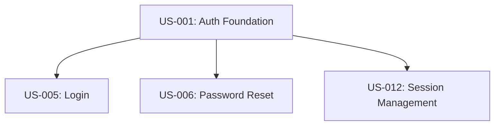

# User Story Instructions & Guidelines

This reference document defines the complete standards, formatting guidelines, criteria schemas, and complete example cases for generating User Stories within the Vespyr agent swarm. The `@product-manager` agent reads this when creating user stories.

---

## 1. Document Standards

Every user story generated must be exhaustive, precise, and highly testable:
*   **Audience:** The engineering team (developers, QA engineers, system architects).
*   **Independence:** Every user story must be self-contained and independently testable.
*   **Location:** All stories are appended to the cumulative backlog file: `artifacts/output/02-strategy/user-stories.md`.

### 1.1 Granularity & Content Standards: Functional Capabilities vs. Persona Journeys

To ensure user stories are developer-ready and sprint-actionable, they must represent **modular functional capabilities** rather than high-level **persona-based scenarios or journeys**.

#### Key Contrast and Guidelines

| Dimension | 🚫 Incorrect (Persona Journeys / Scenarios) |   Correct (Modular Functional Capabilities) |
|:---|:---|:---|
| **Concept** | Broad, end-to-end user paths containing multiple steps and functional domains in a single block. | Fine-grained, modular components focusing on a single system behavior or feature that fits in a single sprint. |
| **Focus** | Subjective, situational user context (e.g. "completes form while walking", "ships purchase under WiFi"). | Objective, digital interaction patterns (user action + system response) that can be verified by automated tests. |
| **Scope** | Too large to fit into a single developer task; hard to sequence, plan, and estimate accurately. | Small, independent, testable units that can be assigned directly to specific sprints (Sprint 1, Sprint 2, etc.). |

#### Examples Baseline

> [!WARNING]
> **DO NOT use persona journeys as user stories.** Review this comparison to ensure you write correct, modular functional stories in the next iteration:

##### 🚫 Incorrect Persona Journeys (Do NOT use)
*   **Event attendee ships purchase:** "Rina scans QR at event booth, completes form in <60s, pays via QRIS, gets printed label" *(Too broad: spans QR entry, form entry, payment, and printing).*
*   **Dropoff visitor skips queue:** "Budi scans QR at dropoff entrance, completes form while walking, gets immediate service" *(Mixes entry, form, and physical logic; uses subjective situational context).*
*   **User in poor network ships:** "Form works with progressive enhancement even on unstable event WiFi." *(This is an offline/NFR behavior, not a functional journey)*

#####   Correct Functional Capabilities (MUST use)
*   `US-001 | QR Code Entry Point (Sprint 1)` — "User scans QR code to access shipping form without app download."
*   `US-002 | Basic Shipping Form (Sprint 1)` — "User completes shipping form with sender, receiver, and package details."
*   `US-003 | Location Auto-Detection (Sprint 2)` — "System auto-detects user location for sender address using GPS/network."
*   `US-005 | QRIS Payment Integration (Sprint 1)` — "User pays for shipping using QRIS or ewallet (GoPay, OVO, Dana)."
*   `US-006 | Label Generation & Printing (Sprint 1)` — "System generates and prints shipping label after payment confirmation."
*   `US-009 | Offline Capability (Sprint 2)` — "Form works with degraded functionality during network issues."


---

### 1.2 Backlog Hierarchy Tree Summary

At the top of the `user-stories.md` file, the product manager must include a high-level tree-structured summary representing how User Stories roll up into Features and Epics.

#### Default Tree Format
Use this specific text-based indentation tree layout by default:

```text
Epic: [Epic Name / e.g., Payment Method Display Module]
    ├── Feature: [Feature Name]
    │   ├── User Story: [US-XXX] - [Title]
    │   └── User Story: [US-YYY] - [Title]
```

#### Custom Formats
While the tree structure above is the default, the user may request or provide their own custom high-level summary format (e.g., table, flat list, spreadsheet link). The `@product-manager` must respect and adapt to the user's custom layout if provided.

---

## 2. Structural Requirements

Backlog files (`user-stories.md`) must be structured hierarchically. Every section must follow the standards below:

### 2.1 Epic Block
An Epic represents a high-level strategic capability or major module (e.g., Payment Method Display Module). It groups related features and establishes context. Format each Epic block exactly as follows:

```markdown
# Epic: [Epic Title]

- **Tracker:** Epic
- **Parent:** [Parent Epic if any / e.g. Core System]
- **Purpose:** [Strategic business intent and problem solved]
- **Phase:** [Validation / Exploration / Design / Development]
- **FRs Covered:** [PRD Functional Requirement IDs / e.g. FR-001, FR-002]
```

### 2.2 Feature Block
A Feature is a discrete, tangible capability rolling up under an Epic (e.g., QRIS Payment Integration). It describes a major functional specification of the product. Format each Feature block exactly as follows:

```markdown
## Feature: [Feature Title]

- **Tracker:** Feature
- **Parent:** [Epic Name]
- **Functional Specification:** [High-level functional behaviors and requirements overview]
- **Success Criteria:** [Telemetry, user metrics, or business results indicating success]
- **FRs:** [Functional requirements mapped from PRD / e.g., FR2, FR50, FR51]
```

### 2.3 User Story Block
User Stories are modular functional capabilities nested under a Feature. Every story block contains the following standardized sections:

#### 2.3.1 Story Metadata Block
- **Tracker:** User Story
- **Story ID:** US-XXX
- **Parent:** [Feature Name]
- **Priority:** [Must-have / Should-have / Could-have / Won't-have]
- **Effort:** [Small / Medium / Large]
- **Sprint:** [Target Sprint / e.g., Sprint 1]
- **Dependencies:** [Story IDs or external blocking events]
- **Author:** @product-manager
- **Traces to PRD:** [Section reference inside requirements.md]
- **Traces to Product Spec:** [Screen Name, Flow ID, or Section ID inside product-spec.md]

#### 2.3.2 Narrative Title Header
The title of the User Story (H3 header) must represent the narrative directly in standard agile format:
`### User Story: As a [type of user], I want [goal], so that [benefit / reason]`
No separate Narrative section is needed, making the document extremely concise.

#### 2.3.3 Business Requirements
Explain the commercial and customer justification for the feature:
*   **Stakeholder Impact:** Who benefits and how?
*   **Value Proposition:** What pain is relieved or gain created?
*   **Financial Implication:** Expected revenue driver, cost reduction, or risk mitigation.
*   **Success Signal:** The measurable telemetry metric (defined with `@data-analyst`) indicating success.
*   **Priority Rationale:** Business justification for the chosen priority level.

#### 2.3.4 Technical Requirements
Exhaustive integration constraints for engineering:
*   **Integration Points:** Associated internal APIs, databases, or external microservices.
*   **Data Requirements:** Exact schemas, formats, inputs, and persistence destinations.
*   **Performance Constraints:** Maximum allowed latency, concurrency, and throughput.
*   **Security Constraints:** Authentication, permissions, encryption, and data masking guidelines.
*   **State Management:** Ephemeral states vs. long-term database storage.
*   **ML Integration (if applicable):** Specific model versions, latency limits (`AC-ML*`), and baseline accuracies.

---

## 3. Acceptance Criteria Guidelines

Acceptance criteria must be atomic, unambiguous, and formatted using highly legible, multi-line, indented Gherkin steps:

*   **Structure:** Under each criteria number, indent and separate each Gherkin step (`Given`, `When`, `Then`, `And`, `But`) on its own separate line.
*   **Format:**
    *   `[ ]` **AC-XX-Y:** [Short summary description of criteria]
        *   **Given** [precondition or initial state]
        *   **When** [user action or system trigger]
        *   **Then** [expected system outcome or state shift]

---

### User Story: As a registered user who forgot my password, I want to receive a password reset email, so that I can regain access to my account without contacting support

- **Tracker:** User Story
- **Story ID:** US-001
- **Parent:** [Security & Authentication]
- **Priority:** Must-have
- **Effort:** Medium
- **Sprint:** Sprint 3
- **Dependencies:** US-000 (user auth system), Email service (external)
- **Author:** @product-manager
- **Traces to PRD:** Section 5.2: Password Reset Capability
- **Traces to Product Spec:** Section 3.1: Screen: Login, Flow: 2.1 Happy Path

#### Business Requirement
*   **Stakeholder impact:** Reduces support ticket volume by ~15% (based on current ticket data).
*   **Value proposition:** Self-service password recovery reduces friction and churn.
*   **Revenue / cost implication:** Saves ~$5k/quarter in support costs.
*   **Success signal:** >80% of reset emails are clicked within 24 hours.
*   **Priority rationale:** Must-have — password recovery is a standard security requirement.

#### Technical Requirement
*   **Integration points:** Auth API (internal), SendGrid (external email service).
*   **Data requirements:** User email, reset token (UUID, 1-hour expiry), token hash stored in DB.
*   **Performance constraints:** Email sent within 5 seconds of request; reset page loads in < 1s.
*   **Security constraints:** Token must be single-use, cryptographically random, stored hashed; rate limit to 3 requests per hour per email.
*   **State management:** Token state: pending → used | expired.
*   **Error handling strategy:** If SendGrid is down, queue email for retry with exponential backoff.

#### Acceptance Criteria

##### Happy Path
*   [ ] **AC-H1:** Send reset email
    *   **Given** the user is on the login page
    *   **When** they click "Forgot password?" and enter a valid registered email
    *   **Then** a reset email is sent and a confirmation message is displayed
*   [ ] **AC-H2:** Navigate to reset form
    *   **Given** the user receives the reset email
    *   **When** they click the reset link within 1 hour
    *   **Then** they are taken to a password reset form
*   [ ] **AC-H3:** Update password successfully
    *   **Given** the user enters a new password that meets complexity requirements and confirms it
    *   **When** they submit the form
    *   **Then** the password is updated and they are logged in automatically
*   [ ] **AC-H4:** Deny login with stale password
    *   **Given** the password is reset
    *   **When** the user tries to log in with the old password
    *   **Then** access is denied

##### Unhappy Path
*   [ ] **AC-U1:** Prevent email enumeration
    *   **Given** the user enters an unregistered email
    *   **When** they submit the forgot-password form
    *   **Then** the system displays the same confirmation message as for a valid email
*   [ ] **AC-U2:** Handle expired reset link
    *   **Given** the user clicks an expired reset link (after 1 hour)
    *   **When** the page loads
    *   **Then** an expiration error message is shown and a new link can be requested
*   [ ] **AC-U3:** Handle already used reset link
    *   **Given** the user clicks an already-used reset link
    *   **When** the page loads
    *   **Then** a token-used error message is shown and a new link can be requested
*   [ ] **AC-U4:** Reject weak passwords
    *   **Given** the user enters a new password that does not meet complexity requirements
    *   **When** they submit
    *   **Then** inline validation errors are shown and the password is not changed
*   [ ] **AC-U5:** Reject mismatched passwords
    *   **Given** the user enters mismatched password and confirmation
    *   **When** they submit
    *   **Then** a mismatch error message is shown and the password is not changed
*   [ ] **AC-U6:** Rate limit reset requests
    *   **Given** the user requests a 4th reset email within 1 hour
    *   **When** they submit
    *   **Then** a rate-limit error is shown and no email is sent
*   [ ] **AC-U7:** Handle email service downtime
    *   **Given** SendGrid is down
    *   **When** the user requests a reset
    *   **Then** the request is successfully queued in the system and a generic confirmation is shown

##### Edge Cases
*   [ ] **AC-E1:** Unicode email support
    *   **Given** the user's email contains special characters or unicode
    *   **When** the reset email is sent
    *   **Then** the email is delivered and the link works correctly
*   [ ] **AC-E2:** Cross-browser recovery
    *   **Given** the user opens the reset link in a different browser than the one they requested from
    *   **When** they submit the new password
    *   **Then** the reset succeeds
*   [ ] **AC-E3:** Form submission timing boundary
    *   **Given** the user requests a reset and opens the link, but waits 61 minutes before submitting the new password
    *   **When** they click submit
    *   **Then** the form rejects with an expiration error
*   [ ] **AC-E4:** Shared email addresses
    *   **Given** two users share an email address
    *   **When** one requests a reset
    *   **Then** only that user's password is affected
*   [ ] **AC-E5:** Revisit used token page
    *   **Given** the user bookmarks the reset page and revisits it after the token is used
    *   **When** the page loads
    *   **Then** a token-invalid error is shown gracefully.

#### UI / UX Notes
*   **Product Spec Screen Reference:** Screen: 3.1 Login Screen, Screen: 3.2 Forgot Password Screen
*   **User Flow Reference:** Happy Path Flow 2.1
*   **Key UI States:** Default, Loading, Validation Error, Success, Server Error
*   **Accessibility requirements (WCAG 2.1 AA):** Custom keyboard tab order (Inputs → Buttons → Cancel), high contrast inputs, and prefers-reduced-motion animation disables.

#### Data Model Notes
*   **Entities:** `password_reset_tokens` (id, user_id, token_hash, expires_at, used_at, created_at).
*   **Validation:** Token must be 32-char hex, password must be 8+ chars with 1 uppercase, 1 lowercase, 1 number.

#### Out of Scope
1.  Phone/SMS reset (future phase).
2.  Password history enforcement.
3.  Account lockout after failed resets.

#### Open Questions
| Question | Impact | Owner | Status |
| :--- | :--- | :--- | :--- |
| Should we invalidate all existing sessions on password change? | Security | Security lead | Open |

---

### Story Dependencies Diagram

For complex features, the `@product-manager` must map the structural dependency tree in Mermaid format. This assists the `@tech-lead` and `@developer` during planning and sequencing:


