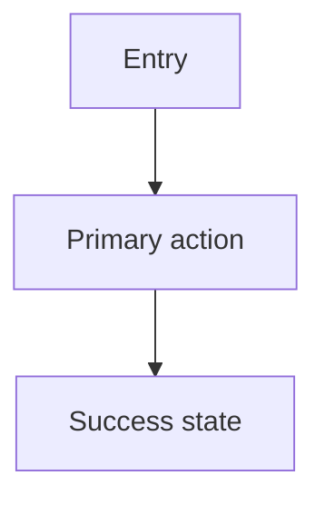
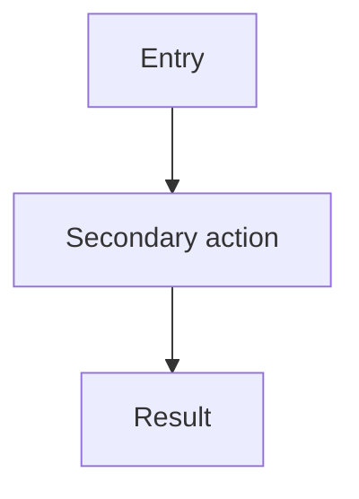
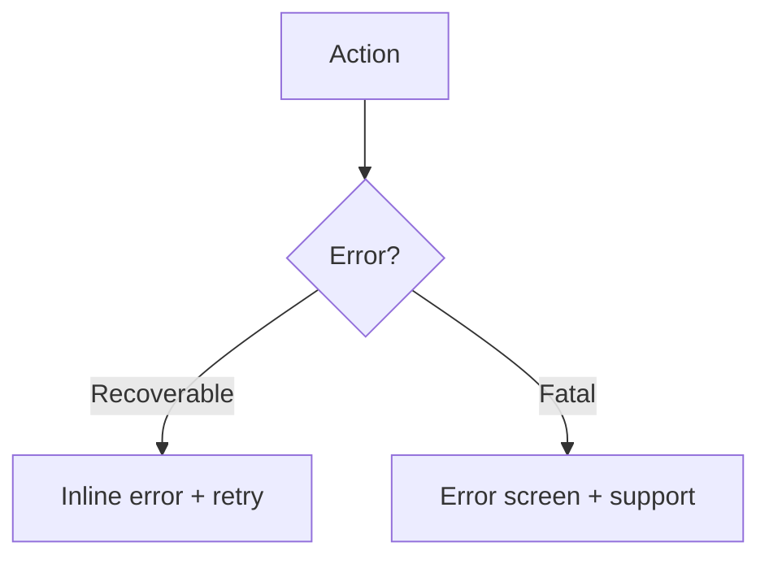

# {Feature Name} — Product Specification

## Overview
- **Feature:** {name}
- **PRD reference:** `requirements.md` CAP-{N}
- **User stories:** `user-stories.md`
- **Design direction:** {2-3 sentence summary of the visual theme and UX approach}
- **Theme rubric:** Sleek Utility / Modern Glassmorphism / Minimalist Tech / Vibrant Brand-First

## User flows

### Happy path

### Alternative paths

### Error flows

## Screen specs

### Screen: {screen name}
**Purpose:** {what this screen does}
**Associated stories:** US-{NNN}
**Entry:** {how user arrives}
**Exit:** {where user goes next}

**Content:**
- {element descriptions}

**Layout:** {arrangement notes, grid references}

**States:**
| State | Visual | Behavior |
|-------|--------|----------|
| Default | | |
| Loading | Skeleton/spinner | |
| Empty | {empty state messaging} | |
| Error | {error messaging + recovery} | |
| Success | {confirmation} | |

**Responsive behavior:** {how layout shifts at each breakpoint}

## Interaction details

| Trigger | Action | Success | Error | Loading |
|---------|--------|---------|-------|---------|
| {user action} | {system response} | {result} | {error handling} | {loading state} |

## Visual system

> Full tokens in `design.md`. Summary below.

| Category | Key decisions |
|----------|--------------|
| Theme | {selected rubric} |
| Primary color | `--color-primary: #{hex}` |
| Typography | {heading font}, {body font} |
| Component style | {rounded/sharp, shadow/flat, etc.} |
| Breakpoints | Mobile / Tablet / Desktop / Wide |

## Edge cases

| Scenario | Story ref | Expected behavior |
|----------|-----------|-------------------|
| {edge case} | US-{NNN} | {how system handles it} |

## Open questions

| # | Question | Owner | Status |
|---|----------|-------|--------|
| 1 | {question} | @{role} | Open / Resolved |

## Cross-references

| Artifact | Link |
|----------|------|
| PRD / Spec kernel | `requirements.md` |
| User stories | `user-stories.md` |
| ADRs | `artifacts/output/03-architecture/` |
| Visual design system | `design.md` |
| Execution plan | `artifacts/output/04-planning/execution-plan.md` |
