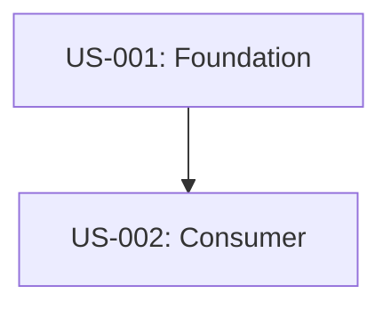

# User Story Template

> **Used by:** Sarah (@product-manager)
> **Feeds into:** Rex (@developer), Nina (@qa-engineer), Grant (@tech-lead), Nova (@data-analyst)
> **Save to:** `artifacts/output/03-strategy/user-stories.md`

**Version:** 2
**Last changed:** 2026-05-20

> [!NOTE]
> Detailed acceptance criteria guidelines, the canonical `US-001` password recovery example, formatting instructions, and dependency diagram guides are located in [.agents/references/templates/user-story-instructions.md](../references/templates/user-story-instructions.md). Refer to that document when generating user stories.

> [!IMPORTANT]
> **User Story Granularity & Content Standards:**
> 1. **Modular Functional Focus:** User stories must represent single functional blocks of capability (e.g. "Location Auto-Detection" or "QRIS Payment Integration"), NOT multi-step persona journeys/scenarios (e.g. "Dropoff visitor skips queue" or "Event attendee ships purchase"). High-level user flows must be sliced into separate, granular stories.
> 2. **Actionable & System-Verifiable:** Describe active interactions (user action + system response) without incorporating situational physical or emotional context.
> 3. **Traceability & Alignment:** Story Priority must align with the corresponding Functional Requirement (`FR-XXX`) in Section 7.3 of the PRD (`requirements.md`). Target Sprints are assigned at the story level for agile execution. Every user story must explicitly populate its `Traces to PRD` field referencing the target Functional Requirement ID (e.g., `FR-001`).
> 4. **Radical Brevity & Concise Language (DNA 7):** Eliminate verbose elaboration, repetitive filler, and complex jargon. Business requirements must be 1-3 direct sentences (outcome, single source of truth, enforcement boundary). Technical requirements must be a concise bulleted contract. Acceptance criteria must use clean, indented Gherkin syntax without narrative bloat.

---

## Backlog Hierarchy Tree (Default)

> [!NOTE]
> By default, provide a high-level tree structure of the backlog hierarchy at the top of `user-stories.md`. If a custom format is specified or requested by the user, that format may be used instead.

```text
Epic: [Epic Name]
    ├── Feature: [Feature Name]
    │   ├── User Story: [User Story Title / ID]
    │   └── User Story: [User Story Title / ID]
    └── Feature: [Feature Name]
        └── User Story: [User Story Title / ID]
```

---

## Hierarchy Structure

### 1. Epic Section
Use this format at the beginning of each Epic boundary inside `user-stories.md`:

# Epic: [Epic Title]

- **Tracker:** Epic
- **Parent:** [Parent Epic if any / e.g. Core System]
- **Purpose:** [Strategic business intent and problem solved]
- **Phase:** [Validation / Exploration / Design / Development]
- **FRs Covered:** [PRD Functional Requirement IDs / e.g. FR-001, FR-002]

---

### 2. Feature Section
Use this format for each Feature rolling up under an Epic:

## Feature: [Feature Title]

- **Tracker:** Feature
- **Parent:** [Epic Name]
- **Functional Specification:** [High-level functional behaviors and requirements overview]
- **Success Criteria:** [Telemetry, user metrics, or business results indicating success]
- **FRs:** FR2, FR50, FR51

---

### 3. User Story Section
Use this format for each modular functional capability under a Feature:

### User Story: As a [type of user], I want [goal], so that [benefit / reason]

- **Tracker:** User Story
- **Story ID:** US-XXX
- **Parent:** [Feature Name]
- **Priority:** Must-have / Should-have / Could-have / Won't-have
- **Effort:** Small / Medium / Large
- **Sprint:** Sprint [Number]
- **Dependencies:** [Story IDs or external blocking events]
- **Author:** @product-manager
- **Traces to PRD:** Section 7.3: FR-XXX [Feature Name from requirements.md]
- **Traces to Product Spec:** [Screen Name, Flow ID, or Section ID inside product-spec.md]

#### Business Requirement
[1-3 direct, plain-language sentences stating the business outcome, single source of truth, and enforcement boundary. No verbose filler.]

#### Technical Requirement
[Compact bulleted list of integration points, data/flag rules, API behavior, error handling, and server vs. client boundaries.]

#### Acceptance Criteria
[Acceptance criteria must be testable, atomic, and formatted using multi-line Given/When/Then steps]

##### Happy Path
*   [ ] **AC-H1:** [Short Summary of Step]
    *   **Given** [precondition]
    *   **When** [user action]
    *   **Then** [expected outcome]

##### Unhappy Path
*   [ ] **AC-U1:** [Short Summary of Failure Handling]
    *   **Given** [failure or invalid condition]
    *   **When** [user action]
    *   **Then** [graceful recovery, error feedback, or safety state]

##### Edge Cases
*   [ ] **AC-E1:** [Short Summary of Edge Case]
    *   **Given** [boundary/concurrency/security extreme state]
    *   **When** [user action]
    *   **Then** [expected graceful handling or state]

##### ML Acceptance Criteria (AC-ML*) — if applicable
*   [ ] **AC-ML-1:** [Short Summary of ML Threshold]
    *   **Given** [prediction input or model state]
    *   **When** [model performs inference]
    *   **Then** [inference latency, accuracy, or metric meets target]

#### UI / UX Notes (if applicable)
*   **Product Spec Screen Reference:** `[Screen Name or Section inside product-spec.md]`
*   **User Flow Reference:** `[Flow name/ID, e.g. Happy Path Flow 2.1]`
*   **Key UI States:** `[Link to corresponding state specs inside product-spec.md]`
*   **Accessibility requirements (WCAG 2.1 AA):** `[Link to accessibility specs inside product-spec.md]`

#### Data Model Notes (if applicable)
[Document affected entities, database fields, and validation rules]

#### Out of Scope for This Story
1.  ...

#### Open Questions
| Question | Impact if unanswered | Owner | Status |
|----------|----------------------|-------|--------|
| ...      | ...                  | ...   | ...    |

---

## Story Dependencies Diagram
[Format cumulative dependency diagram in Mermaid syntax]
