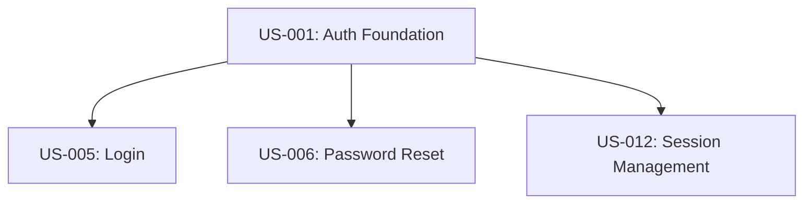

# User Story Instructions & Guidelines

This reference document defines the complete standards, formatting guidelines, criteria schemas, and complete example cases for generating User Stories within the Vespyr agent swarm. The `@product-manager` agent reads this when creating user stories.

---

## 1. Document Standards

Every user story generated must be exhaustive, precise, and highly testable:
*   **Audience:** The engineering team (developers, QA engineers, system architects).
*   **Independence:** Every user story must be self-contained and independently testable.
*   **Location:** All stories are appended to the cumulative backlog file: `artifacts/output/02-strategy/user-stories.md`.

---

## 2. Structural Requirements

Every story block must contain the following standardized sections:

### 2.1 Story Metadata Block
```
Story ID:     US-XXX
Title:        [Active-voice title]
Priority:     [Must-have / Should-have / Could-have / Won't-have]
Effort:       [Small / Medium / Large]
Sprint:       [Target Sprint]
Dependencies: [Story IDs or external blocking events]
Author:       @product-manager
Traces to PRD: [Section reference inside requirements.md]
```

### 2.2 Narrative Format
*   **As a** [specific type of user persona],
*   **I want** [perform a clear action or use a feature],
*   **so that** [achieve a measurable benefit or goal].

### 2.3 Business Requirements
Explain the commercial and customer justification for the feature:
*   **Stakeholder Impact:** Who benefits and how?
*   **Value Proposition:** What pain is relieved or gain created?
*   **Financial Implication:** Expected revenue driver, cost reduction, or risk mitigation.
*   **Success Signal:** The measurable telemetry metric (defined with `@data-analyst`) indicating success.
*   **Priority Rationale:** Business justification for the chosen priority level.

### 2.4 Technical Requirements
Exhaustive integration constraints for engineering:
*   **Integration Points:** Associated internal APIs, databases, or external microservices.
*   **Data Requirements:** Exact schemas, formats, inputs, and persistence destinations.
*   **Performance Constraints:** Maximum allowed latency, concurrency, and throughput.
*   **Security Constraints:** Authentication, permissions, encryption, and data masking guidelines.
*   **State Management:** Ephemeral states vs. long-term database storage.
*   **Error Strategy:** Fallback actions when downstream systems fail.
*   **ML Integration (if applicable):** Specific model versions, latency limits (`AC-ML*`), and baseline accuracies.

---

## 3. Acceptance Criteria Guidelines

Acceptance criteria must be atomic, unambiguous, and formatted using **Given / When / Then** statements:

### 3.1 Happy Path (AC-H*)
*   **Rules:** Cover the end-to-end user path from initial trigger to database save, including UI status shifts (default → loading → success) and automated system notifications.

### 3.2 Unhappy Path (AC-U*)
*   **Rules:** Document every validation fail, server down, network offline, and auth rejection. Never allow silent errors; every error path must preserve data integrity, display a user-facing recovery message, and write structured logs.

### 3.3 Edge Cases (AC-E*)
*   **Rules:** Think in extremes:
    *   *Scale boundaries:* 0, 1, max, max+1, null values, long strings, emojis.
    *   *Time and concurrency:* Double-clicks, back buttons during transitions, concurrent session updates.
    *   *Security constraints:* SQL injections, unauthorized path traversal, expired tokens.

### 3.4 ML Criteria (AC-ML*)
*   **Rules:** Define numerical validation metrics: p95 latency targets, minimum accuracy rates, data drift limits, and bias metrics.

---

## 4. Canonical Example: Password Recovery (US-001)

The following example shows a complete, fully populated user story complying with all standards:

```
Story ID:     US-001
Title:        User can reset password via email
Priority:     Must-have
Effort:       Medium
Sprint:       Sprint 3
Dependencies: US-000 (user auth system), Email service (external)
Traces to PRD: Section 5.2: Password Reset Capability
```

### Narrative
**As a** registered user who forgot their password,
**I want** to receive a password reset email,
**so that** I can regain access to my account without contacting support.

### Business Requirement
*   **Stakeholder impact:** Reduces support ticket volume by ~15% (based on current ticket data).
*   **Value proposition:** Self-service password recovery reduces friction and churn.
*   **Revenue / cost implication:** Saves ~$5k/quarter in support costs.
*   **Success signal:** >80% of reset emails are clicked within 24 hours.
*   **Priority rationale:** Must-have — password recovery is a standard security requirement.

### Technical Requirement
*   **Integration points:** Auth API (internal), SendGrid (external email service).
*   **Data requirements:** User email, reset token (UUID, 1-hour expiry), token hash stored in DB.
*   **Performance constraints:** Email sent within 5 seconds of request; reset page loads in < 1s.
*   **Security constraints:** Token must be single-use, cryptographically random, stored hashed; rate limit to 3 requests per hour per email.
*   **State management:** Token state: pending → used | expired.
*   **Error handling strategy:** If SendGrid is down, queue email for retry with exponential backoff.

### Acceptance Criteria

#### Happy Path
*   [ ] **AC-H1:** Given the user is on the login page, when they click "Forgot password?" and enter a valid registered email, then a reset email is sent and a confirmation message is displayed.
*   [ ] **AC-H2:** Given the user receives the reset email, when they click the reset link within 1 hour, then they are taken to a password reset form.
*   [ ] **AC-H3:** Given the user enters a new password that meets complexity requirements and confirms it, when they submit, then the password is updated and they are logged in automatically.
*   [ ] **AC-H4:** Given the password is reset, when the user tries to log in with the old password, then access is denied.

#### Unhappy Path
*   [ ] **AC-U1:** Given the user enters an unregistered email, when they submit the forgot-password form, then the system displays the same confirmation message as for a valid email (to prevent email enumeration attacks).
*   [ ] **AC-U2:** Given the user clicks an expired reset link (after 1 hour), when the page loads, then an error message is shown and a new link can be requested.
*   [ ] **AC-U3:** Given the user clicks an already-used reset link, when the page loads, then an error message is shown and a new link can be requested.
*   [ ] **AC-U4:** Given the user enters a new password that does not meet complexity requirements, when they submit, then inline validation errors are shown and the password is not changed.
*   [ ] **AC-U5:** Given the user enters mismatched password and confirmation, when they submit, then an error message is shown and the password is not changed.
*   [ ] **AC-U6:** Given the user requests a 4th reset email within 1 hour, when they submit, then a rate-limit error is shown and no email is sent.
*   [ ] **AC-U7:** Given SendGrid is down, when the user requests a reset, then the request is queued and the user sees a generic confirmation message.

#### Edge Cases
*   [ ] **AC-E1:** Given the user's email contains special characters or unicode, when the reset email is sent, then the email is delivered and the link works correctly.
*   [ ] **AC-E2:** Given the user opens the reset link in a different browser than the one they requested from, when they submit the new password, then the reset succeeds.
*   [ ] **AC-E3:** Given the user requests a reset, opens the link, but waits 61 minutes before submitting the new password, when they submit, then the form rejects with an expiration error.
*   [ ] **AC-E4:** Given two users share an email address, when one requests a reset, then only that user's password is affected.
*   [ ] **AC-E5:** Given the user bookmarks the reset page and revisits it after the token is used, when the page loads, then an appropriate error is shown.

### UI / UX Notes
*   **Screens:** Login → Forgot Password Form → Confirmation → Reset Form → Success.
*   **States:** Empty form → Validating → Success / Error.
*   **Navigation:** After success, redirect to dashboard.

### Data Model Notes
*   **Entities:** `password_reset_tokens` (id, user_id, token_hash, expires_at, used_at, created_at).
*   **Validation:** Token must be 32-char hex, password must be 8+ chars with 1 uppercase, 1 lowercase, 1 number.

### Out of Scope
1.  Phone/SMS reset (future phase).
2.  Password history enforcement.
3.  Account lockout after failed resets.

### Open Questions
| Question | Impact | Owner | Status |
| :--- | :--- | :--- | :--- |
| Should we invalidate all existing sessions on password change? | Security | Security lead | Open |

---

## 5. Story Dependencies Diagram

For complex features, the `@product-manager` must map the structural dependency tree in Mermaid format. This assists the `@tech-lead` and `@developer` during planning and sequencing:


