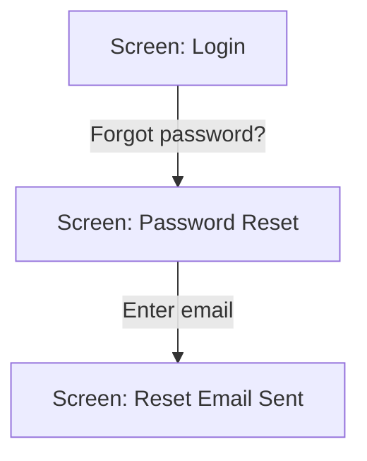
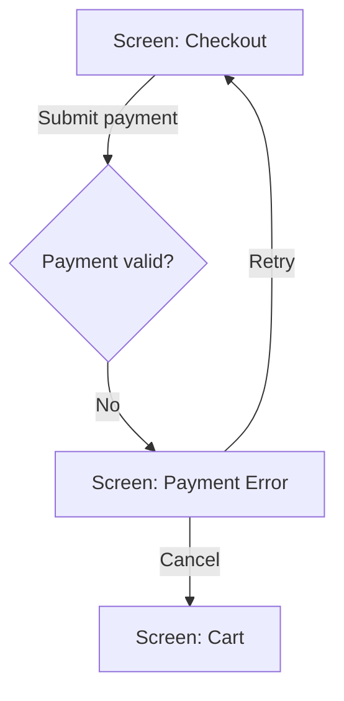

# Product Spec Template

> **Used by:** @product-designer → **Feeds into:** @architect, @developer, @tech-lead, @qa-engineer, @technical-writer

## Output format

**Always generate both files:**
- **`product-spec.md`** — this template. Machine-readable. Used by @architect, @developer, @tech-lead, @qa-engineer as their primary input.
- **`product-spec.html`** — for humans. Fill the same content into `.opencode/templates/product-spec-template.html`.

Write the `.md` first (full content). Then populate the HTML template — same sections, same content, different container.

---

Use this template when writing the product design specification.

This document is the **developer handoff** — it translates business requirements into precise, unambiguous implementation guidance. Every screen, interaction, and state must be defined. If it's not in the spec, it doesn't exist.

---

## 1. Feature Overview

### 1.1 Purpose
One sentence: what does this feature enable the user to do?

### 1.2 Goals
What must be true for this feature to be considered successful?

- [ ] Goal 1: [e.g., "User can complete checkout in under 60 seconds"]
- [ ] Goal 2: [e.g., "Checkout abandonment rate drops below 15%"]
- [ ] Goal 3: ...

### 1.3 Scope
What is included in this release?

1. ...
2. ...
3. ...

### 1.4 Out of Scope
What is explicitly NOT included? (Prevents scope creep during implementation)

1. ...
2. ...
3. ...

### 1.5 Traceability
Map this spec to upstream documents:

| Spec Section | PRD Feature (requirements.md) | User Stories (user-stories.md) |
|-------------|------------------------------|-------------------------------|
| 2. User Flows | Section X.Y | US-001, US-002 |
| 3. Screen: Dashboard | Section X.Y | US-003, US-004 |
| ... | ... | ... |

Rules:
- Every section of this spec must trace to at least one user story
- If a section has no user story, the product manager needs to write one

### 1.6 ML Integration Points (if applicable)
- Where in the user flow does ML output appear?
- What is the fallback if ML service is unavailable?
- How are prediction confidence levels handled in the UI?

---

## 2. User Flows

### 2.1 Primary Flow (Happy Path)

The most common path. Use a Mermaid flowchart or sequence diagram.

```mermaid
flowchart TD
    A[Screen: Login] -->|Enter credentials| B[Screen: Dashboard]
    B -->|Click "New Project"| C[Screen: Project Form]
    C -->|Fill & Submit| D[Screen: Project Created]
```

### 2.2 Alternative Flows

Less common but valid paths.

**Flow 2A: [Name]**


### 2.3 Error Flows

What happens when things go wrong.

**Flow 3A: [Error Name]**


### 2.4 ML-Specific Flows (if applicable)
- **Flow M1:** Prediction loading state → display skeleton → show results or fallback
- **Flow M2:** Model error → display graceful fallback → log for retraining

Rules for flows:
- Every flow must have a start screen and an end screen
- Decision points (diamonds) must have all branches labeled
- Error flows must show recovery paths — never a dead end
- Reference user story IDs in flow descriptions
- ML flows must show loading, success, error, and fallback states

---

## 3. Screen-by-Screen Specifications

For each screen in the flows above, create a detailed spec.

### 3.1 Screen: [Screen Name]

#### 3.1.1 Purpose
What is the user trying to accomplish on this screen?

#### 3.1.2 Content
What information is displayed? List every element.

| Element | Type | Content / Source | Notes |
|---------|------|------------------|-------|
| Header | Text | "Create New Project" | H1, page title |
| Project Name Input | Text field | User input | Required, max 100 chars |
| Description Input | Text area | User input | Optional, max 500 chars |
| Submit Button | Button | "Create Project" | Primary action |
| Cancel Link | Link | "Cancel" | Returns to dashboard |

#### 3.1.3 Layout
Describe the visual hierarchy and arrangement. Include a simple ASCII wireframe or reference to a design file.

```
+------------------------------------------+
|  Header: "Create New Project"            |
+------------------------------------------+
|                                          |
|  Project Name * [________________]       |
|  (Error msg below field)                 |
|                                          |
|  Description  [________________]          |
|              [________________]          |
|              [________________]          |
|                                          |
|  [Create Project]    Cancel              |
|                                          |
+------------------------------------------+
```

#### 3.1.4 States

Define EVERY state this screen can be in.

**Default State**
- Form is empty
- Submit button is enabled
- No validation messages

**Loading State**
- Trigger: User clicks "Create Project"
- Visual: Submit button shows spinner, form fields are disabled
- Duration: Until API responds (timeout: 10s)
- Behavior: User cannot interact with form

**Success State**
- Trigger: API returns 201 Created
- Visual: Green toast notification "Project created successfully"
- Navigation: Redirect to new project detail page after 2s
- Data: New project appears in user's project list

**Error State — Validation**
- Trigger: User submits with empty required field
- Visual: Red border on invalid field, inline error message below
- Behavior: Form does not submit, focus moves to first error
- Message: "Project name is required"

**Error State — Server**
- Trigger: API returns 5xx or 4xx (non-validation)
- Visual: Red inline banner at top of form
- Behavior: Form fields retain values, user can retry
- Message: "Something went wrong. Please try again."
- Recovery: "Retry" button re-submits; "Cancel" returns to dashboard

**Empty State**
- Trigger: N/A (this is a creation form)
- Note: If applicable, describe what empty means for this screen type

**ML State (if applicable)**
- **Loading AI results:** Show skeleton/placeholder while model processes
- **AI results displayed:** Show predictions with confidence indicator
- **AI error / fallback:** Show cached/default content with subtle "AI unavailable" note
- **AI uncertainty:** For low-confidence predictions, show disclaimer or request user confirmation

#### 3.1.5 Entry Points
How does the user get here?

| Entry Point | From Screen | Trigger | Precondition |
|------------|-------------|---------|-------------|
| Dashboard | Dashboard | Click "New Project" button | User is authenticated |
| Direct URL | Any | Type `/projects/new` | User is authenticated |

#### 3.1.6 Exit Points
Where can the user go next?

| Exit Point | To Screen | Trigger | Condition |
|-----------|-----------|---------|-----------|
| Success | Project Detail | Auto-redirect | Project created successfully |
| Cancel | Dashboard | Click "Cancel" | Any time |
| Error | Same screen | Validation fails | Retain form state |

#### 3.1.7 Accessibility Requirements
- Keyboard navigation order: Project Name → Description → Submit → Cancel
- Screen reader labels: Every input has associated `<label>`
- Focus management: On error, focus moves to first invalid field
- Color contrast: All text meets WCAG 2.1 AA (4.5:1 minimum)
- Reduced motion: Respect `prefers-reduced-motion` for animations

---

### 3.2 Screen: [Next Screen Name]
[Same structure as 3.1]

---

## 4. Interaction Details

### 4.1 Global Interactions

Interactions that apply across multiple screens.

| Interaction | Trigger | Action | Feedback | Error Handling |
|-------------|---------|--------|----------|----------------|
| Pull to refresh | Swipe down on mobile | Reload data | Spinner + content update | Offline: cached data with "last updated" timestamp |
| Network offline | Connection lost | Show banner | Persistent banner at top | Auto-hide when connection restored |
| Session expiry | Token expires | Redirect to login | Modal: "Session expired, please log in again" | Save form state in localStorage for recovery |

### 4.2 Component Interactions

Detailed specs for reusable or complex interactions.

#### 4.2.1 [Component Name]

**Behavior:**
- Trigger: [What starts the interaction?]
- Action: [What happens?]
- Animation: [Any motion or transition? Duration? Easing?]
- Sound: [Any audio? Most products: none]

**States:**
- Default: ...
- Hover: ... (desktop only)
- Active/Pressed: ...
- Disabled: ...
- Loading: ...

**Error Handling:**
- What happens if the interaction fails?
- How does the user recover?

**Example: Infinite Scroll List**
- Trigger: User scrolls to bottom of list
- Action: Load next 20 items from API
- Feedback: Show loading spinner at bottom
- Success: Append items, remove spinner
- Error: Show "Tap to retry" button at bottom
- Edge case: If 0 items returned, show "No more items" text

### 4.3 AI/ML Interaction Patterns (if applicable)

#### Streaming Responses
- Show typing indicator or progressive reveal as results arrive
- Allow user to cancel long-running operations

#### Confidence Display
- High confidence (>80%): Display result directly
- Medium confidence (50-80%): Display with "Suggested" label
- Low confidence (<50%): Show as suggestion, request user confirmation

#### Model Feedback Loop
- Allow users to rate/correct predictions
- Route corrections to model improvement pipeline

---

## 5. Visual Direction & Design System

### 5.1 Typography

| Level | Font | Size | Weight | Line Height | Usage |
|-------|------|------|--------|-------------|-------|
| H1 | Inter | 24px | 600 | 1.3 | Page titles |
| H2 | Inter | 18px | 600 | 1.4 | Section headers |
| Body | Inter | 14px | 400 | 1.5 | General text |
| Caption | Inter | 12px | 400 | 1.4 | Helper text, labels |

### 5.2 Color Palette

| Token | Hex | Usage |
|-------|-----|-------|
| `--color-primary` | `#3B82F6` | Primary buttons, links, active states |
| `--color-success` | `#10B981` | Success messages, confirmations |
| `--color-error` | `#EF4444` | Error messages, validation |
| `--color-warning` | `#F59E0B` | Warnings, non-blocking issues |
| `--color-text-primary` | `#1F2937` | Headings, primary content |
| `--color-text-secondary` | `#6B7280` | Captions, placeholders |
| `--color-background` | `#FFFFFF` | Page background |
| `--color-surface` | `#F3F4F6` | Cards, elevated surfaces |

### 5.3 Spacing Scale

| Token | Value | Usage |
|-------|-------|-------|
| `--space-xs` | 4px | Tight gaps, icon padding |
| `--space-sm` | 8px | Inline elements |
| `--space-md` | 16px | Standard gap |
| `--space-lg` | 24px | Section gaps |
| `--space-xl` | 32px | Page-level spacing |

### 5.4 Component States

Standard state definitions for all interactive components:

| State | Visual Treatment | Interaction |
|-------|------------------|-------------|
| Default | Token colors | Pointer cursor |
| Hover | 10% darker | Pointer cursor |
| Active/Pressed | 20% darker, 1px inset shadow | Pointer cursor |
| Focus | 2px outline, `--color-primary` | Keyboard navigable |
| Disabled | 50% opacity, `not-allowed` cursor | No interaction |
| Loading | Skeleton/spinner, disabled | No interaction |

### 5.5 Responsive Behavior

| Breakpoint | Width | Key Changes |
|-----------|-------|-------------|
| Mobile | < 640px | Single column, full-width buttons, bottom sheet modals |
| Tablet | 640-1024px | Two columns where applicable, side navigation |
| Desktop | > 1024px | Full layout, hover states active, multi-column grids |

### 5.6 Accessibility Tokens

| Token | Value | Usage |
|-------|-------|-------|
| `--focus-ring-width` | 2px | Focus outline width |
| `--focus-ring-color` | `#3B82F6` | Focus ring color |
| `--min-touch-target` | 44px | Minimum touch target size (WCAG) |
| `--reduced-motion` | `prefers-reduced-motion` | Disable animations when user prefers |

---

## 6. Edge Cases & Error Handling

### 6.1 System-Level Edge Cases

| Scenario | Expected Behavior | User Story Ref |
|----------|-------------------|----------------|
| User loses connection mid-submission | Form state saved to localStorage; "Retry" button appears when connection restored | US-XXX |
| User hits browser back button during async operation | Show confirmation modal: "Leave without saving?" | US-XXX |
| User has 10,000+ items in list | Pagination (50/page) + search + filter; lazy load images | US-XXX |
| User pastes formatted text into plain text field | Strip formatting silently | US-XXX |
| User uploads 500MB file | Reject with message: "Max file size is 50MB" | US-XXX |
| User rapidly double-clicks submit button | Disable button after first click; ignore subsequent clicks | US-XXX |
| User opens same page in two tabs | Changes in Tab A reflect in Tab B (real-time sync or refresh on focus) | US-XXX |

### 6.2 Content Edge Cases

| Scenario | Expected Behavior |
|----------|-------------------|
| Very long text (1000+ chars) in small container | Truncate with ellipsis, show full text on hover (tooltip) or expand |
| Empty state (0 items) | Show empty state illustration + "Get started" CTA |
| Single item | Show normally; do not show "1 items" (grammar) |
| Special characters in user input | Accept and render correctly (test: `<>"'&` and emojis) |
| Right-to-left language | Mirror layout; text direction `rtl` |
| High contrast mode | Respect OS setting; do not override |

### 6.3 AI/ML Edge Cases (if applicable)

| Scenario | Expected Behavior |
|----------|-------------------|
| Model returns no results | Show empty state with "No suggestions available" |
| Model returns low-confidence result | Display with uncertainty indicator; don't auto-apply |
| Model timeout (>10s) | Show fallback results or "Still thinking..." with cancel option |
| Model returns offensive/inappropriate content | Filter with safety layer; show generic fallback |
| Rapid successive queries | Queue or debounce; don't spam the model |
| Model version rolled back | Maintain user session state; don't lose context |

---

## 7. Open Questions & Decisions

| Question | Impact | Owner | Deadline | Status |
|----------|--------|-------|----------|--------|
| ... | Blocks implementation / Can defer | ... | ... | Open / Resolved |

---

## 8. Cross-References

| Reference | Document | Section |
|-----------|----------|---------|
| Business requirements | `artifacts/output/02-strategy/requirements.md` | §5 Feature Overview |
| User stories | `artifacts/output/02-strategy/user-stories.md` | All |
| Architecture decisions | `artifacts/output/03-architecture/` | Relevant ADRs |
| Competitive positioning | `artifacts/output/01-research/competitive-analysis.md` | §3 Feature Matrix |
| User research | `artifacts/output/01-research/user-personas.md` | Personas |

---

**Document info:**
- Version: 2.0
- Author: @product-designer
- Date: ...
- Inputs: `artifacts/output/02-strategy/requirements.md` + `artifacts/output/02-strategy/user-stories.md`
- Supersedes: v1.0 (added ML integration points, ML-specific flows, AI edge cases, accessibility tokens, cross-references section)