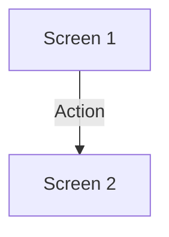

# Product Spec Template

> **Used by:** @product-designer → **Feeds into:** @architect, @developer, @tech-lead, @qa-engineer, @technical-writer

**Version:** 2
**Last changed:** 2026-05-20

> [!NOTE]
> Detailed guidelines, component treatments, design system tokens, responsive behaviors, accessibility standards, and edge cases are located in [.opencode/references/templates/product-spec-instructions.md](../references/templates/product-spec-instructions.md). Refer to that document when generating specs.

## Output format
Generate both `product-spec.md` (this template) and `product-spec.html` (copy content to `.opencode/templates/product-spec-template.html`).

---

## 1. Feature Overview

### 1.1 Purpose
[One sentence: what does this feature enable the user to do?]

### 1.2 Goals
[What must be true for this feature to be considered successful?]
- [ ] Goal 1: ...

### 1.3 Scope
[What is included in this release?]
1. ...

### 1.4 Out of Scope
[What is explicitly NOT included?]
1. ...

### 1.5 Traceability
Map section to PRD requirements and story IDs:
| Spec Section | PRD Feature | User Stories |
|-------------|-------------|--------------|
| ...         | ...         | ...          |

### 1.6 ML Integration Points (if applicable)
[Specify ML output appearance, confidence representation, and service failure fallback.]

---

## 2. User Flows
[Provide Mermaid diagrams for Primary, Alternative, Error, and ML flows as defined in references]

### 2.1 Primary Flow (Happy Path)

### 2.2 Alternative Flows
[Alternative flows diagram]

### 2.3 Error Flows
[Error/Recovery flows diagram]

### 2.4 ML-Specific Flows (if applicable)
[ML inference/uncertainty flow diagram]

---

## 3. Screen-by-Screen Specifications

### 3.1 Screen: [Screen Name]
**Associated User Stories:** `[US-XXX]`, `[US-YYY]`

#### 3.1.1 Purpose
[Action user is trying to accomplish.]

#### 3.1.2 Content
| Element | Type | Content / Source | Notes |
|---------|------|------------------|-------|
| ...     | ...  | ...              | ...   |

#### 3.1.3 Layout
[Provide wireframe or ASCII layout]

#### 3.1.4 States
[Define Default, Loading, Success, Validation Error, Server Error, Empty, and ML States as specified in product-spec-instructions.md]

#### 3.1.5 Entry Points
[From Screen, Trigger, and Preconditions]

#### 3.1.6 Exit Points
[To Screen, Trigger, and Conditions]

#### 3.1.7 Accessibility Requirements
[Keyboard tab order, screen reader labels, and focus management details]

---

## 4. Interaction Details

### 4.1 Global Interactions
[Describe global interactions like refresh, offline banners, session expiry]

### 4.2 Component Interactions
[Describe infinite scrolling, AI streaming, confidence badges, etc.]

### 4.3 AI/ML Interaction Patterns (if applicable)
[Streaming reveals, confidence thresholds, feedback buttons]

---

## 5. Visual Direction & Design System
[Align visual specifications to design tokens in product-spec-instructions.md]

### 5.1 Typography
[Typography treatments]

### 5.2 Color Palette
[Color tokens and usage]

### 5.3 Spacing Scale
[Spacing tokens and usage]

### 5.4 Component States
[Hover, active, focus, disabled styling rules]

### 5.5 Responsive Behavior
[Breakpoints and key layout shifts]

### 5.6 Accessibility Tokens
[Contrast ratios and motion reductions]

---

## 6. Edge Cases & Error Handling

### 6.1 System-Level Edge Cases
| Scenario | Expected Behavior | Story Ref |
|----------|-------------------|-----------|
| Connection lost in submission | Save state to localStorage. Trigger retry alert on reconnection | `US-XXX` |
| Browser back during async op | Show confirmation prompt overlay: "Leave without saving?" | `US-XXX` |
| 10,000+ items in list | Pagination (50 items/page) + search filtering + media lazy loading | `US-XXX` |
| Formatted text pasted into field | Strip formatting styling silently. Keep raw text characters | `US-XXX` |
| File upload exceeds limit | Reject immediately with toast banner: "Max file size is 50MB" | `US-XXX` |
| Double-click submit | Disable submit button on click. Ignore subsequent submit events | `US-XXX` |
| Same page open in two tabs | Sync changes in real-time or request refresh on tab active focus | `US-XXX` |

### 6.2 Content-Specific Edge Cases
| Scenario | Expected Behavior |
|----------|-------------------|
| Very long content values | Truncate text safely with ellipsis; expose full value on hover tooltip |
| Zero state / Empty lists | Show empty state illustration + clear "Get Started" primary action CTA |
| Single item in list | Render normally, fix list count labels (avoid "1 items" grammar error) |
| Special character inputs | Sanitize and render safely — cover tags: `<>"'&` and emojis |
| RTL locale layouts | Mirror entire layout elements visually by applying standard `dir="rtl"` |
| High contrast OS mode | Honor system configuration colors, don't override standard layout specs |

---

## 7. Open Questions & Decisions
| Question | Impact | Owner | Deadline | Status |
|----------|--------|-------|----------|--------|
| ...      | ...    | ...   | ...      | ...    |

---

## 8. Cross-References
| Reference | Document | Section |
|-----------|----------|---------|
| ...       | ...      | ...     |

---

**Document info:**
- Version: 2.0
- Author: @product-designer
- Date: ...
- Inputs: `artifacts/output/02-strategy/requirements.md` + `artifacts/output/02-strategy/user-stories.md`