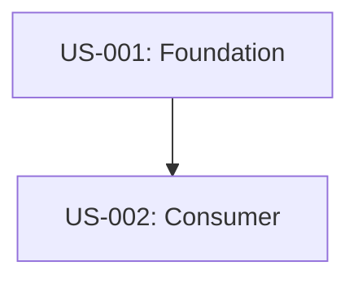

# User Story Template

> **Used by:** @product-manager → **Feeds into:** @developer, @qa-engineer, @tech-lead, @data-analyst
> **Save to:** `artifacts/output/02-strategy/user-stories.md`

**Version:** 2
**Last changed:** 2026-05-20

> [!NOTE]
> Detailed acceptance criteria guidelines, the canonical `US-001` password recovery example, formatting instructions, and dependency diagram guides are located in [.opencode/references/templates/user-story-instructions.md](../references/templates/user-story-instructions.md). Refer to that document when generating user stories.

> [!IMPORTANT]
> **User Story Granularity & Content Standards:**
> 1. **Modular Functional Focus:** User stories must represent single functional blocks of capability (e.g. "Location Auto-Detection" or "QRIS Payment Integration"), NOT multi-step persona journeys/scenarios (e.g. "Dropoff visitor skips queue" or "Event attendee ships purchase"). High-level user flows must be sliced into separate, granular stories.
> 2. **Actionable & System-Verifiable:** Describe active interactions (user action + system response) without incorporating situational physical or emotional context.
> 3. **Perfect Alignment:** Story ID, Title, Priority, Sprint, and Summary must perfectly match Section 5.3 in the PRD (`requirements.md`).


---

## Story Metadata (apply to every story)

```
Story ID:     US-XXX
Title:        [Brief, active-voice title]
Priority:     Must-have / Should-have / Could-have / Won't-have
Effort:       Small / Medium / Large
Sprint:       ...
Dependencies: [Story IDs or external blocking events]
Author:       @product-manager
Traces to PRD: Section X.Y: [Feature Name from requirements.md]
Traces to Product Spec: [Screen Name, Flow ID, or Section ID inside product-spec.md]
```

---

## Story Structure

### 1. Narrative

**As a** [type of user],
**I want** [goal],
**so that** [benefit / reason].

### 2. Business Requirement
[Document stakeholder impact, value proposition, financial implications, success signal, and priority rationale as detailed in user-story-instructions.md]

### 3. Technical Requirement
[Document integration points, data requirements, performance/security constraints, state management, error handling, and ML strategy as detailed in user-story-instructions.md]

### 4. Acceptance Criteria
[Acceptance criteria must be testable, atomic, and formatted using Given/When/Then]

#### 4.1 Happy Path
*   [ ] **AC-H1:** Given [precondition], when [user action], then [expected outcome]

#### 4.2 Unhappy Path
*   [ ] **AC-U1:** Given [failure condition], when [user action], then [graceful error recovery and data preservation]

#### 4.3 Edge Cases
*   [ ] **AC-E1:** Given [boundary/concurrency/security extreme], when [user action], then [graceful handling]

#### 4.4 ML Acceptance Criteria (AC-ML*) — if applicable
*   [ ] **AC-ML-1:** Given [prediction request], when [model processes], then [prediction metric ≥ target]

### 5. UI / UX Notes (if applicable)
*   **Product Spec Screen Reference:** `[Screen Name or Section inside product-spec.md]`
*   **User Flow Reference:** `[Flow name/ID, e.g. Happy Path Flow 2.1]`
*   **Key UI States:** `[Link to corresponding state specs inside product-spec.md]`
*   **Accessibility requirements (WCAG 2.1 AA):** `[Link to accessibility specs inside product-spec.md]`

### 6. Data Model Notes (if applicable)
[Document affected entities, database fields, and validation rules]

### 7. Out of Scope for This Story
1.  ...

### 8. Open Questions
| Question | Impact if unanswered | Owner | Status |
|----------|----------------------|-------|--------|
| ...      | ...                  | ...   | ...    |

---

## Story Dependencies Diagram
[Format cumulative dependency diagram in Mermaid syntax]
