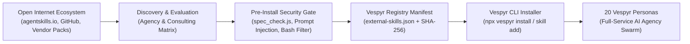

# External Agent Skills Ingestion & Research Plan (03a)

> **Release:** v2.1  
> **Status:** Planned  
> **Date:** 2026-09-03  
> **Focus:** Transforming Vespyr into an AI Agency + Consultant Team via automated external skill ingestion.  
> **Depends on:** `02e-phase-1-agentskills-standardization.md` (agentskills.io spec + `spec_check.js`), `02h-phase-1-graph-shutup-and-cli.md` (CLI installer modernization), `08-cross-cutting-utter-satisfaction-dna.md` (verification gates).  
> **Precedes:** `03b-phase-2-mcp-integration-plan.md` (MCP protocol and server integration).  
> **Pre-configures & Handoffs To:** `06-phase-5-deeper-bench.md` (Phase 5 Deeper Bench personas: `@finance-analyst`, `@accessibility-architect`, `@seo-specialist`, `@growth-marketer`, `@presentation-master`, `@database-engineer`, etc.).

---

## 1. Executive Summary & Vision

Vespyr’s goal is to operate not merely as a software coding bot, but as a full-service **AI Agency + Consultant Team**. 

In high-tier client engagements, an agency team is expected to deliver across six core practice pillars:
1. **Management & Strategy Consulting** (market sizing, financial modeling, unit economics, MECE problem solving).
2. **Product & UX Design Agency** (discovery, heuristic evaluation, design system audits, WCAG 2.2 accessibility).
3. **Technical Delivery & Tech Due Diligence** (codebase audits, architecture review for M&A/investors, cloud FinOps).
4. **Security, Compliance & Governance** (SOC2/HIPAA checklists, OSS license attribution, API security).
5. **Growth, Marketing & Digital Advisory** (technical SEO/AEO, conversion rate optimization, positioning).
6. **Client Deliverable & Presentation Engine** (executive client memos, RFP/SOW proposals, steering committee decks).

Rather than reinventing these specialized methodologies from scratch, Vespyr's installer (`bin/cli.js`) will be equipped with an automated **External Skill Ingestion Pipeline**. This system discovers, evaluates, vets, and embeds proven, high-utility agent skills from the global ecosystem (`agentskills.io`, GitHub, and vendor packages) directly into `.agents/skills/`.



---

## 2. Comparative Baseline: Current 43 Skills vs. Consulting/Agency Needs

Vespyr ships with 43 internal skills. While strong in early concept validation and the standard MVP build loop, significant capability voids exist when operating as an enterprise consultancy or multi-disciplinary agency.

| Agency Practice Vertical | What Vespyr Already Has (43 Internal Skills) | What Is Missing (External Consulting/Agency Capabilities) | Target External Skill Solutions |
| :--- | :--- | :--- | :--- |
| **Strategy & Management Consulting** | Concept stress-testing (`validate-idea`), problem deconstruction (`unpack-problem`, `root-cause`), questioning (`grill-me`, `brainstorming`). | Financial modeling, unit economics, market sizing (TAM/SAM/SOM), strategic management frameworks (MECE, BCG, 7S, Porter's 5 Forces). | • Market Sizing & TAM/SAM/SOM Calculator<br>• SaaS Unit Economics & Pricing Strategy<br>• MECE Issue Tree & McKinsey 7S Analyzer |
| **Product & UX Design Agency** | User journey (`journey-map`), empathy mapping (`empathy-map`), jobs (`jtbd`), screen specs (`design`, `motion`), discovery reports (`discovery-report`). | Formal heuristic evaluation (Nielsen Norman 10), CRO auditing, accessibility compliance scoring (WCAG 2.2 / VPAT), design system token auditing. | • Nielsen Norman Heuristic Evaluation<br>• CRO (Conversion Rate Optimization) Audit<br>• Accessibility & Contrast Auditor (WCAG AA/AAA) |
| **Tech Due Diligence & Engineering Advisory** | MVP build loop (`plan`, `develop`, `review`, `test`), incident response (`incident`), post-launch (`launch`, `iterate`, `retro`). | M&A / Investor Tech Due Diligence, technical debt scoring, architectural compliance audits, cloud cost optimization (FinOps). | • Codebase Health & Tech Debt Scorer<br>• Cloud FinOps / AWS & GCP Cost Optimizer<br>• IaC / Terraform Architecture Auditor |
| **Security, Compliance & Governance** | General code review checks (`review`). | Formal compliance readiness (SOC2, HIPAA, GDPR, ISO 27001), automated dependency license scanning, secret leakage scans. | • SOC2 & HIPAA Readiness Checklist<br>• License Compliance & OSS Attribution Scanner<br>• OWASP Top 10 & API Security Auditor |
| **Growth, Marketing & Digital Advisory** | General market research (`explore-idea`). | Technical SEO & AEO (AI Engine Optimization), schema markup validation, programmatic SEO strategy, copy & positioning teardowns. | • Technical SEO & AEO Site Auditor<br>• Programmatic SEO & Schema Generator<br>• Copywriting & Messaging Teardown |
| **Client Deliverable & Account Management** | Educational content (`craft-lesson`), AI voice normalization (`humanize`). | Executive client briefings, formal proposal / RFP / SOW generation, slide deck structuring, steering committee summaries. | • Executive Briefing & Client Memo Formatter<br>• SOW & RFP Proposal Generator<br>• Steering Committee Deck Outliner |

---

## 3. Detailed External Skill Practice Domains

### Practice 1: Management & Strategy Consulting
- **TAM/SAM/SOM Sizing (`/market-sizing`):** Top-down and bottom-up market estimation formulas, industry CAGR projections, and market segmentation models.
- **Unit Economics & SaaS Metrics (`/saas-metrics`):** LTV, CAC, payback period, churn rate, Net Revenue Retention (NRR), gross margin, and Rule of 40 calculations.
- **MECE Strategy Problem Solver (`/mece-tree`):** Mutually Exclusive, Collectively Exhaustive issue trees, hypothesis-led problem deconstruction, and 80/20 prioritization.
- **Enterprise Consulting Frameworks (`/consulting-frameworks`):** Automated synthesis across Porter's 5 Forces, McKinsey 7S, BCG Growth-Share Matrix, and PESTLE analysis.

### Practice 2: Product & UX Design Agency
- **Heuristic Usability Audit (`/heuristic-eval`):** Systematic review against the 10 Nielsen Norman usability heuristics with severity ratings (0–4) and visual defect logs.
- **Accessibility & Contrast Validator (`/a11y-audit`):** Automated checks for WCAG 2.2 AA/AAA compliance, focus states, screen-reader semantics, and color contrast ratios.
- **Conversion Rate Optimization Audit (`/cro-audit`):** Landing page friction analysis, call-to-action (CTA) hierarchy, form field optimization, and cognitive load reduction.

### Practice 3: Tech Due Diligence & Engineering Advisory
- **Codebase Due Diligence (`/tech-due-diligence`):** Pre-acquisition and investment technical audit: code quality, test coverage ratios, dependency vulnerability health, single point of failure (SPOF) risks, and technical debt quantification.
- **Cloud FinOps & Cost Optimization (`/cloud-finops`):** AWS, GCP, and Azure cost audit: idle resource detection, reserved instance sizing, egress cost optimization, and multi-region cost modeling.
- **Infrastructure as Code Audit (`/iac-audit`):** Terraform/OpenTofu and Kubernetes manifest evaluation against CIS benchmarks and security standards.

### Practice 4: Security, Compliance & Governance
- **Compliance Readiness Assessment (`/compliance-check`):** Evidence collection, gap analysis, and policy readiness for SOC 2 Type II, ISO 27001, HIPAA, and GDPR.
- **License Compliance & SBOM (`/license-audit`):** Software Bill of Materials (SBOM) generation, viral license contagion detection (GPL in proprietary code), and attribution notices.
- **API & OWASP Security Audit (`/api-security`):** BOLA, rate-limiting, authentication flaws, and OWASP API Security Top 10 validation.

### Practice 5: Growth, Marketing & Digital Advisory
- **Technical SEO & AEO Audit (`/seo-aeo-audit`):** Core Web Vitals impact, crawlability, canonicals, robots.txt, structured JSON-LD data, and optimization for AI search engines (Perplexity, ChatGPT Search, Gemini).
- **Positioning & Copy Teardown (`/copy-teardown`):** Value proposition clarity audit, headline testing, customer persona alignment, and message-market fit scoring.

### Practice 6: Client Deliverable Engine
- **Executive Client Briefing (`/client-memo`):** Converting complex technical and strategy findings into concise 1-page executive memos for C-suite stakeholders.
- **SOW & RFP Proposal Generator (`/sow-proposal`):** Scope of Work generation with milestone breakdowns, deliverables, assumption logs, and staffing estimates.
- **Steering Committee Deck Outliner (`/deck-outline`):** Structuring 10-12 slide narrative presentations for board meetings, client kickoffs, and milestone check-ins.

---

## 4. Persona Gap-Fill & Strategic Alignment Matrix

A critical design requirement is that external skills ingested during Phase 2 must bridge two eras:
1. **Immediate Execution:** Equipping the **Current Team (v2.0 / Phase 2 Base — 23 Personas)** with high-leverage agency & consulting capabilities right now.
2. **Future Continuity:** Establishing the battle-tested workflows that will transition seamlessly to the **Future Deeper Bench (`06-phase-5-deeper-bench.md` — 45 Personas)** in Phase 5 without redundant rewrites.

### 4.1 Current Bench Stewardship (Phase 2 Baseline)

In Phase 2, the current 19 reasoning personas act as domain stewards for the newly ingested skills:

| Current Persona (v2.0) | Agency Role in Phase 2 | Ingested Skills Stewarded | Operational Responsibilities |
| :--- | :--- | :--- | :--- |
| **`@founder` (Elena)** | Executive Strategy & Advisory Lead | `/market-sizing`, `/consulting-frameworks`, `/saas-metrics`, `/deck-outline` | Executive concept teardown, macro market sizing, high-level business model & unit economics validation. |
| **`@product-manager` (Sarah)** | Product Strategy & Account Director | `/mece-tree`, `/sow-proposal`, `/client-memo` | Structured hypothesis trees, client engagement scoping (SOWs), executive memo drafting. |
| **`@product-designer` (Ivy)** | Creative & UX/UI Director | `/heuristic-eval`, `/cro-audit`, `/a11y-audit` | Nielsen Norman 10 usability reviews, landing page conversion audits, interim accessibility checks. |
| **`@ux-researcher` (Zara)** | User Experience & Research Lead | `/heuristic-eval`, `/a11y-audit` | User friction mapping, cognitive load audits, screen-reader user journey validation. |
| **`@researcher` (Iris)** | Market & Competitive Intelligence | `/market-sizing`, `/consulting-frameworks` | Industry data extraction, competitor pricing intelligence, TAM/SAM/SOM research synthesis. |
| **`@architect` (Vera)** | Technical Advisory & Due Diligence | `/tech-due-diligence`, `/iac-audit` | Investor-readiness codebase audits, technical debt quantification, Terraform/IaC posture. |
| **`@tech-lead` (Grant)** | Engineering Delivery Lead | `/tech-due-diligence`, `/sow-proposal` | Engineering task feasibility, technical risk logs, implementation staffing estimates for proposals. |
| **`@data-analyst` (Nova)** | Financial & Telemetry Modeler | `/saas-metrics`, `/seo-aeo-audit` | LTV/CAC modeling, churn telemetry, cohort retention analysis, search traffic telemetry. |
| **`@security-engineer` (Victor)** | Security, Risk & Compliance Auditor | `/compliance-check`, `/license-audit`, `/api-security` | SOC 2 / HIPAA gap analysis, open-source SBOM & license contagion scans, OWASP API audits. |
| **`@performance-engineer` (Felix)** | Systems & Cloud Cost Engineer | `/cloud-finops`, `/seo-aeo-audit` | AWS/GCP cloud waste elimination, Core Web Vitals profiling, technical search crawlability. |
| **`@technical-writer` (Clara)** | Client Deliverable & Narrative Lead | `/client-memo`, `/copy-teardown`, `/sow-proposal` | Client-facing documentation polish, executive memo formatting, marketing copy clarity audits. |

---

### 4.2 Future Handoff & Alignment with Phase 5 Deeper Bench (v2.2)

As detailed in [`06-phase-5-deeper-bench.md`](file:///Users/christianhadianto/Documents/TechSmith/vespyr/artifacts/docs/strategy/development-plan/06-phase-5-deeper-bench.md), Phase 5 expands Vespyr from 23 to 45 personas. The external skills ingested and stabilized in Phase 2 become the native operating tools for these new specialist roles:

| Ingested External Skill | Phase 2 Interim Steward | Phase 5 Permanent Specialist (`06-phase-5-deeper-bench.md`) | Strategic Handoff & Evolution |
| :--- | :--- | :--- | :--- |
| **`/saas-metrics`** | `@founder` / `@data-analyst` | **`@finance-analyst` (Ledger, T2.7)** | `@finance-analyst` assumes full ownership of financial models, Stripe/Paddle billing logic, dunning workflows, LTV/CAC, and marginal token costs. |
| **`/a11y-audit`** | `@product-designer` / `@ux-researcher` | **`@accessibility-architect` (Aria, T1.11)** | Dedicated screen-reader testing (VoiceOver/NVDA/JAWS), keyboard navigation, WCAG 2.2 AA/AAA POUR compliance, and strict anti-overlay audits. |
| **`/seo-aeo-audit`** | `@performance-engineer` / `@data-analyst` | **`@seo-specialist` (Clio, T1.7)** | Specialized technical SEO audits: schema.org JSON-LD, hreflang, robots.txt, sitemaps, internal-link graphs, and AI search visibility (Perplexity/ChatGPT/Gemini). |
| **`/copy-teardown`** | `@technical-writer` | **`@growth-marketer` (Funé, T1.6) & `@brand-voice-curator` (Echo, T2.5)** | Funé applies April Dunford's 10-step positioning framework; Echo enforces the 4-axis brand tone spectrum (Formal/Casual, Serious/Playful, Respectful/Irreverent, Enthusiastic/Matter-of-fact). |
| **`/deck-outline`** | `@founder` | **`@presentation-master` (Lindenberg, T1.5)** | Slide-by-slide Duarte sparkline architecture, visual hierarchy briefs, and ruthless 3-second-rule audits for investor and client decks. |
| **`/consulting-frameworks`** | `@founder` / `@researcher` | **`@innovation-strategist` (Davin, T1.2) & `@brainstormer` (Thoth, T1.1)** | Davin evaluates sustaining vs. disruptive positioning (Christensen, Blue Ocean, Wardley Maps); Thoth conducts divergent ideation using the 61-method catalog. |
| **`/tech-due-diligence` & `/iac-audit`** | `@architect` / `@tech-lead` | **`@database-engineer` (Cassandra, T1.8), `@api-designer` (Mercury, T1.9), `@migration-engineer` (Agni, T1.12)** | Deep specialized due diligence: Cassandra inspects indexing & query execution plans; Mercury audits public vs. internal API contracts; Agni evaluates expand-migrate-contract safety. |
| **`/heuristic-eval` & `/cro-audit`** | `@product-designer` | **`@customer-success` (Lin, T1.13) & `@support-engineer` (Aegis, T1.14)** | Feeds real user friction from account health scores and support ticket pattern extraction directly into CRO and UX remediation roadmaps. |
| **Client Deliverables (`/client-memo`)** | `@technical-writer` | **`@storyteller` (Oda, T1.4) & `@content-engineer` (Quin, T2.6)** | Oda injects McKee value-charge storytelling and mythic-arc structure; Quin manages hub-and-spoke content distribution across marketing channels. |
| **Deliverable Quality Gate** | Peer review | **`@artifact-judge` (Minerva, T1.14b)** | All artifacts produced by ingested skills are evaluated across 4 fixed axes (Accuracy, Completeness, Relevance, Tone) using Minerva's weakest-axis verdict logic. |

---

## 5. Security & Ingestion Gate (Pre-Install Firewall)

External agent skills downloaded from the internet execute with model privileges. Under Vespyr Core DNA, unvetted prompt files represent arbitrary execution vectors (indirect prompt injection, credential theft, destructive bash scripts).

Every external skill MUST pass the **4-Tier Ingestion Gate** before being placed in `.agents/skills/`:

```
External Skill Source (Internet)
       │
       ▼
[ Tier 1: Spec Validator (spec_check.js) ]
  • Frontmatter parses cleanly
  • Name matches directory (ASCII kebab, ≤64 chars)
  • Description bounded (1–1024 chars, no raw folded syntax)
  • Allowed keys only (agentskills.io spec)
       │
       ▼
[ Tier 2: Bash & Permission Safety Filter ]
  • Regex scan for destructive shell commands (rm -rf, mkfs, dd)
  • Prohibit piped network shells (curl ... | bash, wget ... | sh)
  • Prohibit unauthorized environment variable exfiltration
       │
       ▼
[ Tier 3: Prompt Injection & Instruction Audit ]
  • Scan for hidden system instructions or role hijacking
  • Verify no bypass of Vespyr Core DNA or UTTERLY SATISFIED release gates
       │
       ▼
[ Tier 4: Token Economy & Footprint Cap ]
  • SKILL.md body capped at ≤ 500 lines
  • Structured references only; no ad-hoc 5,000-token bloat
       │
       ▼
Install Approved → Placed in .agents/skills/
```

Enforcement script: `.agents/scripts/skill_audit.js` (runs in CI and inside the installer).

---

## 6. Installer Architecture & CLI Workflow

### 6.1 Curated Registry Manifest (`external-skills.json`)
A version-controlled manifest stored in `.agents/registry/external-skills.json` pins trusted external skills by version and cryptographic hash:

```json
{
  "$schema": "./schema/external-skills.schema.json",
  "version": "1.0.0",
  "skills": {
    "market-sizing": {
      "source": "github:vespyr-ecosystem/skill-market-sizing@v1.2.0",
      "category": "consulting",
      "sha256": "e3b0c44298fc1c149afbf4c8996fb92427ae41e4649b934ca495991b7852b855",
      "owner": "founder",
      "tier": "curated-default"
    },
    "heuristic-eval": {
      "source": "github:vespyr-ecosystem/skill-heuristic-eval@v1.0.4",
      "category": "design-agency",
      "sha256": "f4c8996fb92427ae41e4649b934ca495991b7852b855e3b0c44298fc1c149afb",
      "owner": "product-designer",
      "tier": "curated-default"
    }
  }
}
```

### 6.2 CLI Subcommands in `bin/cli.js`

```bash
# 1. Standard install (installs Vespyr core + curated default agency skills)
npx vespyr install

# 2. Add an individual external skill from registry or verified GitHub repo
npx vespyr skill add market-sizing
npx vespyr skill add github:org/repo@v1.0.0

# 3. List installed and available skills in the registry
npx vespyr skill list
npx vespyr skill list --available

# 4. Audit installed skills against spec and security gates
npx vespyr skill audit

# 5. Update installed external skills to latest pinned versions
npx vespyr skill update
```

### 6.3 Installation Lifecycle
1. Installer reads `.agents/registry/external-skills.json`.
2. Downloads the skill package tarball or raw markdown files to a temporary sandbox directory.
3. Computes the SHA-256 hash and validates it against the manifest.
4. Executes `node .agents/scripts/spec_check.js` and `node .agents/scripts/skill_audit.js`.
5. If clean, unpacks to `.agents/skills/<skill-name>/`.
6. Executes `node .agents/scripts/compile_skills.js` to automatically re-index `skills-catalog.json` for `/help-me`.

---

## 7. Research & Delivery Roadmap

| Milestone | Deliverable | Scope & Acceptance Criteria |
| :--- | :--- | :--- |
| **M1: Ecosystem Survey & Curation** | Research Catalog | Survey `agentskills.io`, GitHub, and agency toolkits. Deliver top 15 candidate skills across the 6 practice domains with license and quality evaluation. |
| **M2: Ingestion & Safety Engine** | `.agents/scripts/skill_audit.js` | Implement the 4-tier pre-install gate (spec check, bash safety, prompt injection detection, token economy). |
| **M3: Registry Manifest** | `external-skills.json` | Draft the initial curated bundle manifest with pinned commit SHAs and verified hashes. |
| **M4: Installer Integration** | `bin/cli.js` extension | Implement `skill add`, `skill list`, `skill audit`, and automated bundle installation in `npx vespyr install`. |
| **M5: Dogfooding & Field Test** | Agency Workflow Audit | Run an end-to-end client engagement simulation (Market Sizing → Heuristic UX Audit → Due Diligence Audit → Client Memo) using newly embedded skills. |

---

## Completion Checklist

**03a status: PLANNED (v2.1 Scope — Not Started).**

- [ ] Consulting and agency practice domain catalog defined
- [ ] 4-Tier pre-install security gate (`skill_audit.js`) specified
- [ ] Curated external skills manifest (`external-skills.json`) designed
- [ ] Installer CLI integration (`skill add`, `skill list`, `skill audit`, `skill update`)
- [ ] End-to-end client engagement simulation verified

---

## 8. Sign-Off

**@founder (Elena):** PENDING — Review of consulting and business modeling practice domains.  
**@architect (Vera):** PENDING — Review of ingestion pipeline and registry manifest architecture.  
**@security-engineer (Victor):** PENDING — Review of 4-tier security filter and prompt injection safeguards.  
**@tech-lead (Grant):** PENDING — Review of CLI commands and execution estimates.
