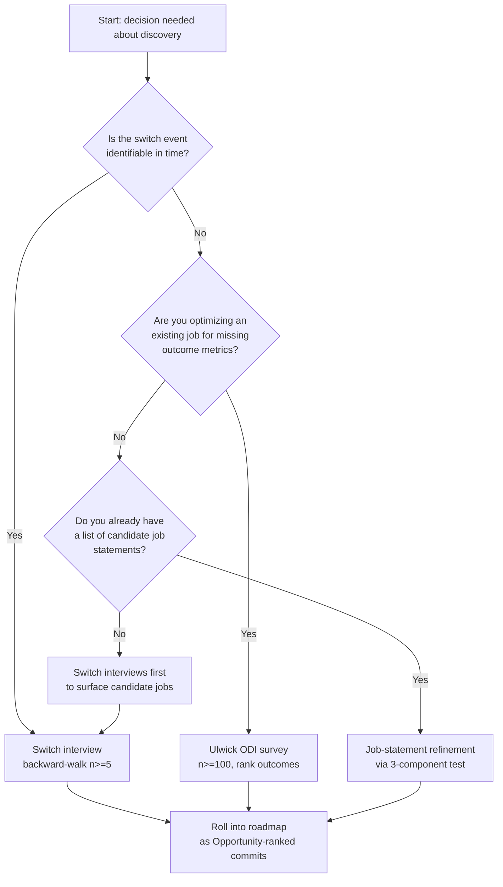

# JTBD Cheatsheet — Scannable Quick Reference

> **Quick reference only.** No "If Nothing Else" callouts (per `teaching-style.md` cheatsheet: false). Mistake-prone pitfall warnings live in the *Pitfalls* section, not in inline callout blocks.

---

## 1. Core Concept & Terminology Matrix

| Term | 1-Sentence Definition |
|---|---|
| **Job** | The progress a person is trying to make in a particular circumstance. |
| **Job statement** | Grammatical object: `verb + object + context clarifier` (Ulwick form or Bedford form). |
| **Main job** | The single job primarily hired for; surrounded by 3–8 related jobs. |
| **Outcome statement** | Ulwick ODI: `minimize the time/likelihood + verb + object + context` or `maximize the extent + ...` |
| **Opportunity Score** | `I + max(I − S, 0)` where I=Importance (1–10), S=Satisfaction (1–10) |
| **Switch interview** | Backward-walking interview anchored at switch event; reveals causation not rationalization. |
| **Forces of Progress** | Push / Pull (pro-switch) vs. Anxiety / Inertia (anti-switch). |
| **First thought** | Earliest upstream trigger where user registered "something needs to change." |
| **Job timeline** | First thought → passive looking → active looking → decision → onboarding → ongoing use. |
| **North-Star metric** | Job-completion indicator (leading), not engagement count (lagging). |

---

## 2. Decision Tree — When to Use Which Discovery Method



---

## 3. Essential Syntax & Templates

### 3.1 Ulwick Job Statement

```
When I [situation],
I want to [motivation],
so I can [expected outcome].
```

### 3.2 Bedford Job Statement

```
Help me [verb] [object] [context clarifier].
```

### 3.3 Outcome Statement Templates (3 mandatory forms)

```
Minimize the time it takes to <verb> <object> <context>.
Minimize the likelihood of <negative outcome> when <verb> <object> <context>.
Maximize the extent to which <verb> <object> <context>.
```

### 3.4 Opportunity Score

```
Opportunity(I, S) = I + max(I - S, 0)
```

Decision rule: rank opportunities high → low; commit to top 3–5 per release.

### 3.5 Forces-of-Progress Worksheet

```
Event (date) | Force (Push/Pull/Anxiety/Inertia) | Trigger | Quote
```

---

## 4. Common Pitfalls & Anti-Patterns

| Mistake / Symptom | Solution / Fix |
|---|---|
| **Aspirational job** ("be more productive") | Replace "be" verb with concrete verb; add object + circumstance ("reconcile invoices in <2 hrs at month-end"). |
| **Solution-shaped job** ("use a mobile app") | Replace named solution with underlying functional progress ("catch up on news while commuting"). |
| **Persona-driven jobs** (jobs vary only by persona label) | Re-cluster by circumstance; retire redundant persona bins. |
| **Single-interview generalization** (roadmap pivots on n=1) | Minimum n=5 switch interviews per cluster before committing. |
| **Ignoring Anxiety/Inertia** (high pull + push, low conversion) | Allocate ~25% of release to onboarding that reduces Anxiety/Inertia. |
| **Engagement-as-North-Star** | Replace with job-completion proxy (e.g., % of users ending month within budget, not DAU). |
| **Forward-walk interview** (rationalization instead of causation) | Reverse chronology from switch event backward to first thought. |
| **Low-Saturation trap** (investing where S is already high) | Compute Opportunity Score; invest only where I high, S low. |
| **Job-surface collision** (two jobs crowd one surface) | Resolve by separable audience / separable circumstance / explicit deprioritization. |
| **Silent compromise** (decision deferred without record) | Write to `artifacts/memory/active-decisions.md`; name the bench item. |

---

## 5. Quick Reference Diagnostic Questions

- Does the job statement's verb produce an observable artifact? **If no → reject.**
- Are context clarifiers specific (date, duration, operand)? **If no → reject.**
- Did the switch interview walk *backward* from the switch event? **If no → redo.**
- Did you exceed n=4 per cluster? **If no → interview more before committing.**
- Is the North-Star metric *job completion*, not engagement? **If no → re-define.**
- Did each release explicitly address Anxiety/Inertia levers during onboarding? **If no → ticket.**

---

*Source: derives from the same Master Knowledge Map (`artifacts/output/teaching/knowledge-map.md`) as `handbook.md`. Style discipline applied: no rhetorical callouts; maximum information density per page; tables replace prose. Verify negative gating — this file contains **zero** "If Nothing Else, Remember This" callout blocks; contrast with `handbook.md` which contains five (one per chapter).*