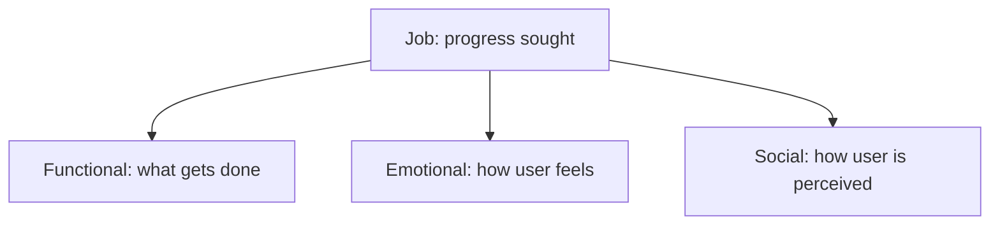
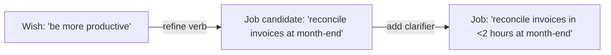
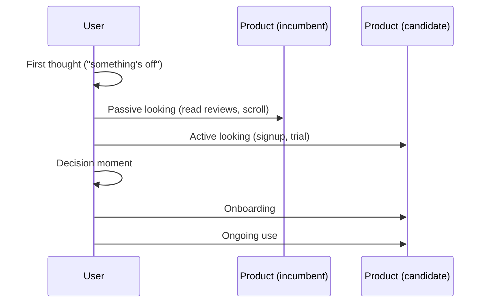

# Handbook: Jobs-to-Be-Done — A Cross-Functional Operator's Guide

> **Intermediate style** — for cross-functional teams transitioning from persona-led to outcome-led product work. Generated by `/craft-lesson` smoke run 2026-07-31 from `knowledge-map.md`.

## About This Handbook

This handbook translates the five-module **Master Knowledge Map** into a self-contained reference. Each chapter ends with an **"If Nothing Else, Remember This"** callout per `teaching-style.md` (handbook: true). Citations are inline `[N]` and resolved in the References section.

**Audience:** Product managers, designers, engineers, and researchers who already build products and need a working command of JTBD concepts — not a survey course.

**Style commitment:** Every technical term is defined inline on first use. Diagrams use Mermaid where they replace prose. Code/math blocks carry annotation.

---

## Chapter 1 — Foundations: What a "Job" Really Is

### 1.1 The Reframe — From Attributes to Progress

For most of the last twenty years, product teams have organized discovery around the **persona**: a description of *who* the user is — their age, role, technical literacy, goals, frustrations, and a name like "Marketing Mary" [1]. JTBD inverts the unit of analysis. Instead of describing the user, we describe the **progress the user is trying to make in a particular circumstance**. That progress — the hiring of a product to get a job done — is referred to as a **Job**.

A Job is therefore not:
- a task ("open the app"),
- a feature request ("add dark mode"),
- a need ("I need a CRM"),
- a persona ("busy sales rep"),

but the **functional, emotional, and social outcome the user is trying to reach** when they reach for a product.

### 1.2 The Milkshake Origin

The paradigmatic study is Christensen's milkshake research [1]. A fast-food chain wanted to sell more milkshakes. Conventional segmentation by customer attributes yielded nothing useful. When the researchers instead asked *what job is the milkshake being hired to do?*, they found two distinct jobs:

- **Morning job**: commuters hiring the milkshake to occupy them during a long, boring drive and stave off hunger until noon.
- **Afternoon job**: fathers hiring the milkshake as a low-cost way to demonstrate love to their child without seeming overly indulgent.

The product was identical; the **jobs were unrelated**. Once the jobs were visible, the chain could redesign the beverage for the morning job (thicker, with fruit chunks, easier to one-hand in a car) without harming the afternoon job. This is theJTBD promise: target the job, not the demographic.

### 1.3 Three Nested Dimensions of a Job

Every Job carries three dimensions that must be specified to be actionable:

1. **Functional** — the practical, observable thing accomplished ("reconcile invoices in under 2 hours at month end").
2. **Emotional** — how the user wants to feel during/after ("feel confident the books will close on time without rework").
3. **Social** — how the user expects to be perceived by relevant others ("look prepared when the CFO asks a question").



Specifying one dimension and ignoring the others produces roadmap features that score on functional KPIs but fail on retention — because they don't move emotional/social outcomes.

### 1.4 Why JTBD ≠ Personas

A persona answers *who*. A job answers *why*. The two are not interchangeable and often conflict:

- Two personas can hire the same product for the **same** job (morning milkshake: commuter and student both need a 20-minute driving companion).
- One persona can hire **different** products for **different** jobs (the same commuter hires a podcast for the morning job and an energy drink for the "fight afternoon slump" job).

Personas still have value for messaging, branding, and UX tone — but they should defer to jobs for roadmap prioritization [1][3].

> [!IMPORTANT]
> **If Nothing Else, Remember This:**
> People don't buy products — they *hire* them to make progress in a specific circumstance. The product is the means, not the end. Switch your unit of analysis from "who is the user" to "what progress is the user trying to make".

### Active Recall

1. Write your own definition of a Job without using the words *task*, *feature*, or *need*.
2. Give one example each of the functional, emotional, and social dimension for the job of "hire a meal-delivery service on a weeknight".
3. Why would a roadmap built on personas outperform or underperform a roadmap built on jobs? Defend both sides briefly.

### References (Chapter 1)

- [1] Christensen, C. M., Hall, T., Dillon, K., & Duncan, D. S. (2016). "Know Your Customers' 'Jobs to Be Done'." *Harvard Business Review*.
- [3] Spiekermann, C. (2018). "Jobs to be Done: A Framework for Customer Needs." *jobs-to-be-done.com*.

---

## Chapter 2 — Core Mechanics: Job Statements & Forces of Progress

### 2.1 The Job Statement Template

A Job worth roadmap investment is written as a precise grammatical object, not an aspiration. Two acceptable forms are in common practice:

- **Ulwick form** [2]: `When I [situation], I want to [motivation], so I can [expected outcome].`
- **Bedford form**: `Help me [verb] [object] [context clarifier].`

Both share three required components:

| Component | Role | Test |
|---|---|---|
| **Verb** | actionable, third-person ("reconcile", "extract", "summarize") | avoid "be", "have", "use" |
| **Object** | the artifact or domain acted upon ("invoices", "field samples", "visitor metrics") | concrete noun, not a category |
| **Context clarifier** | narrowing constraint ("at month-end", "within 2 hours", "without leaving the IDE") | circumstantial, not generic |

A statement that fails any of the three tests is not a job; it is a wish.



### 2.2 Main Job and Related Jobs

A user typically has **one main job** they are primarily hiring the product to do, surrounded by **3–8 related jobs** in the same circumstance family. JTBD discipline demands you catalogue the whole system before ranking [2][3].

Example — for a data analyst:

- *Main job*: reconcile monthly revenue against payout ledger before the 5th
- *Related jobs*: audit individual payouts for fraud signals, explain variances to FP&A, archive reconciliations for auditor requests, rebuild reports when upstream feeds change

Cataloguing related jobs surfaces the full surface area of opportunity. Prioritizing the main job alone misses adjacent demand.

### 2.3 The Four Forces of Progress

Bob Moesta's empirically grounded extension of JTBD holds that switching behavior is governed by **four competing forces** [3]:

| Force | Direction | Source |
|---|---|---|
| **Push** of the current situation | Pro-switch | Frustration, pain, or opportunity missed with the status quo |
| **Pull** of the new solution | Pro-switch | Promised functionality, identity, or experience of the alternative |
| **Anxiety** of the new solution | Anti-switch | Fear the alternative won't deliver, learning curve, switching sunk cost |
| **Inertia** of the current situation | Anti-switch | Sunk cost, habit, integration entanglement with the status quo |

```mermaid
flowchart LR
    Current[Current situation] -.push.-> Switch[Switch]
    New[New solution] -.pull.-> Switch
    New -.anxiety.-> -.-> Switch
    Current -.inertia.-> -.-> Switch
```

Empirically, **Anxiety + Inertia exceed Push + Pull** in most non-switchers. Push and pull are necessary but rarely sufficient. The implication: most "viral messaging" efforts fail because they invest entirely in pull while ignoring the dominant anti-switch forces.

### 2.4 The JTBD Timeline

A switch is the outcome of an extended timeline, not a single decision event:



The **first thought** — the moment the user registers that "something needs to change" — is the upstream cause of the switch. Products that win switches locate the first-thought trigger and instrument it (outbound content, integration discovery, partner channels) [3].

> [!IMPORTANT]
> **If Nothing Else, Remember This:**
> A job statement is a precise grammatical object — verb, object, contextual clarifier — not a vague aspiration. Switching is a four-force tug-of-war, and Anxiety + Inertia usually outweigh Push + Pull.

### Active Recall

1. Refactor the statement "be more productive at work" into a Ulwick-form job statement with all three components.
2. For a recent tool you switched off, name one force in each of the four forces that was active in your switch.
3. Why does an investment in Pull messaging alone rarely produce a switching market?

### References (Chapter 2)

- [2] Ulwick, A. W. (2016). *Jobs To Be Done: From Theory to Practice*. Idea Press.
- [3] Spiekermann, C. (2018). "Jobs to be Done: A Framework for Customer Needs." *jobs-to-be-done.com*.

---

## Chapter 3 — Operationalization: Switch Interviews & Job Mining

### 3.1 Switch Interview Protocol

JTBD discovery is not satisfied by attitudinal surveys or usability tests; it requires **switch interviews** [3] conducted in a specific temporal order.

Protocol:

1. **Anchor first**: identify the precise moment of switching (date, location, surrounding event).
2. **Walk backward** from switch to **first thought**: reconstruct the timeline of triggers, evaluations, and hesitations.
3. **Code forces event-by-event**: for each event, identify which of Push / Pull / Anxiety / Inertia was active and what triggered it.
4. **Stop forward speculation**: when the participant says "I would have…", redirect to observable behavior.

Forward recall reconstructs a rational story and *rationalizes* the switch. Backward recall recovers causation.

### 3.2 Forces Extraction Worksheet

Per interview transcript, produce a four-column table:

| Event (date) | Force active | Trigger | Quote |
|---|---|---|---|
| 2026-04-12 | Push | Manual export took 4 hours | "I missed the standup." |
| 2026-04-25 | Pull | Saw competitor demo at conference | "Their live query looked instant." |
| 2026-05-02 | Anxiety | Concerned about migrating 50 dashboards | "What if I lose the audit trail?" |
| 2026-05-10 | Inertia | Excel formulas deeply integrated | "We've invested two years in those sheets." |
| 2026-05-15 | Switch event | Budget approved | "We bit the bullet." |

Aggregating 5+ such worksheets surfaces repeatable force patterns across individuals.

### 3.3 Job Statement Synthesis

Cluster observed narratives into candidate job statements. Each candidate must pass the three-component test (verb, object, clarifier). Reject candidates that:
- name a product or category ("use Notion"),
- describe a tactic ("search keywords"),
- lack a circumstance ("organize documents").

### 3.4 Outcome Statements (Ulwick ODI)

For each Job, Ulwick's Outcome-Driven Innovation [2] prescribes enumerating 10–50 **outcome statements**: the specific metrics of success the user applies to that job. Outcome statements use one of three grammatical templates:

- **Minimize the time** it takes to `<verb> <object> <context>`.
- **Minimize the likelihood** of `<negative outcome>` when `<verb> <object> <context>`.
- **Maximize the extent** to which `<verb> <object> <context>`.

Example, for the job "reconcile invoices in under 2 hours at month-end":

- Minimize the time it takes to *fetch supplier invoices from email* at month-end.
- Minimize the likelihood of *duplicate line items going unnoticed* when reconciling invoices at month-end.
- Maximize the extent to which *reconciled totals match general ledger entries* at month-end.

### 3.5 Opportunity Algorithm Scoring

For each outcome statement, collect survey responses (n ≥ 100, target audience) on two 1–10 scales:

- **Importance** I
- **Satisfaction** S (with the current way of satisfying the outcome)

Compute:

$$\text{Opportunity}(I, S) = I + \max(I - S, 0)$$

Outcomes where Importance is high and Satisfaction is low receive the largest scores; these define priority targets. Outcomes with high Satisfaction already saturate (Opportunity ≤ I); do not invest there.

> [!IMPORTANT]
> **If Nothing Else, Remember This:**
> Walk interviews *backward* from the switch event — forward recall produces rationalization; backward recall produces causation. Opportunity lives where Importance is high and Satisfaction is low.

### Active Recall

1. Write a switch interview opening script that anchors the participant in a specific switching date.
2. Given a Job and three observed events in the transcript, code each to one of the four forces with a one-line trigger statement.
3. Write three outcome statements (one per template) for the job "catch up on industry news while commuting by train".

### References (Chapter 3)

- [2] Ulwick, A. W. (2016). *Jobs To Be Done: From Theory to Practice*. Idea Press.
- [3] Spiekermann, C. (2018). "Jobs to be Done: A Framework for Customer Needs." *jobs-to-be-done.com*.

---

## Chapter 4 — Integration: From Jobs to Product Decisions

### 4.1 Roadmap Prioritization

Translate ranked Opportunity Scores into commits:

1. Plot all candidate outcomes with their Opportunity Score.
2. Cap each release to **3–5 top-scoring outcomes** for that quarter.
3. Defer features tied to low-Opportunity jobs even when they have vocal internal advocates.

Opportunity replaces gut prioritization; it does not replace engineering sequencing (technical dependencies may force reordering).

### 4.2 Design Brief Generation

Each top job becomes a design brief:

| Field | Content |
|---|---|
| Job statement | `<validated job>` |
| Target circumstance | `<segment, scenario>` |
| Current force balance | `<push/pull/anxiety/inertia summary>` |
| Proposed force shift | `<which force(s) to address and by what UX lever>` |
| Success metric | `<job-completion indicator>` |

Design briefs that omit the *force shift* row are feature requests in disguise; reject them.

### 4.3 Messaging and Positioning

External marketing messaging targets the **Pull** force — promise the future state. Onboarding UX targets the **Anxiety** and **Inertia** forces — reduce fear and switching sunk cost. Conflating the two (aggressive marketing messaging in onboarding) increases anxiety without moving pull.

### 4.4 Metric Selection

Choose a **North-Star metric** that reflects progress on the hired-for job, not engagement with surfaces [1][2]. Engagement metrics (daily active users, session length) are lagging indicators; **job-completion rate** is the leading indicator.

Example: for a budgeting app hired for the job "stay within budget this month":

- ❌ Lagging: daily-active users, number of categories configured.
- ✅ Leading: percentage of subscribed users who end the month within budget (job-completion proxy).

### 4.5 Conflict Resolution Across Jobs

When two top jobs crowd the same product surface (same button, same dashboard, same wizard), the conflict must be resolved explicitly — never by silent compromise:

- *Separable audience*: serve job A on surface variant 1, job B on surface variant 2 (e.g., distinct menus).
- *Separable circumstance*: serve job A in weekday mode, job B in weekend mode (if circumstance differs predictably).
- *Explicit deprioritization*: name which job is on the bench and record the trade in `artifacts/memory/active-decisions.md`.

> [!IMPORTANT]
> **If Nothing Else, Remember This:**
> The job is the unit of roadmap strategy. Engagement metrics that don't reflect job completion are vanity metrics.

### Active Recall

1. Given a list of 18 outcomes with Importance and Satisfaction scores, identify the top 3 commitment items per the Opportunity formula.
2. Draft a design brief for one of your current product features using the five-row brief template. Identify the row that distinguishes a feature request from a job-driven brief.
3. Pick two leading indicators vs. two lagging indicators for a Slack-like product's "stay in the loop without context-switching" job.

### References (Chapter 4)

- [1] Christensen, C. M., Hall, T., Dillon, K., & Duncan, D. S. (2016). "Know Your Customers' 'Jobs to Be Done'." *Harvard Business Review*.
- [2] Ulwick, A. W. (2016). *Jobs To Be Done: From Theory to Practice*. Idea Press.

---

## Chapter 5 — Pitfalls & Anti-Patterns

### 5.1 Aspirational Jobs

**Symptom**: the verb is "be" or "have", the object is an abstract noun, the context clarifier is absent (e.g., "be more productive").

**Diagnosis**: the writer has skipped discovery and filled the template with a desired identity rather than an observed progress.

**Fix**: drill to a concrete circumstance — `When I [month-end close], I want to [reconcile supplier invoices automatically], so I can [close books within 2 hours].` Push for a verb that produces an observable artifact.

### 5.2 Solution-Shaped Jobs

**Symptom**: the verb or object names a solution category ("use a mobile app", "have a dashboard").

**Diagnosis**: the writer is solution-spotting rather than job-framing.

**Fix**: replace with the functional progress beneath the named solution — "catch up on industry news while waiting in line" rather than "use a mobile news app".

### 5.3 Persona-Driven Jobs

**Symptom**: jobs vary by persona label ("Enterprise Erin's job" vs. "Startup Sam's job") but are semantically identical in circumstance.

**Diagnosis**: the discovery team reproduced legacy persona segmentation instead of allowing circumstance to drive the cluster.

**Fix**: re-cluster by circumstance. Retire redundant persona bins. Keep persona metadata where messaging tone depends on it.

### 5.4 Single-Interview Generalization

**Symptom**: roadmap pivots based on one compelling switch story.

**Diagnosis**: cognitive ease of a vivid narrative overwhelmed the n=1 statistics.

**Fix**: require **minimum n=5 switch interviews per cluster** before committing roadmap weight to a job. Document the threshold in the team's research operating procedure.

### 5.5 Ignoring Anxiety and Inertia

**Symptom**: brilliant new feature launches, conversion is sluggish, churn spikes in the onboarding first 14 days.

**Diagnosis**: the team invested in Pull (messaging) and Push (feature parity), forgot Anxiety (onboarding disorientation) and Inertia (data import paths from incumbent).

**Fix**: ticket a quarter of onboarding work upfront per major release — explicitly to reduce Anxiety and Inertia. Measure first-week uninstall rate; instrument Anxiety events (back-button spikes, time-on-task in first session).

> [!IMPORTANT]
> **If Nothing Else, Remember This:**
> Most JTBD failures come from skipping the discipline — writing jobs from the conference-room whiteboard instead of from backward-walk interviews.

### Active Recall

1. Diagnose the malformed job `"be a better engineer"` using the symptom/fix template.
2. State a concrete n-threshold and explain why n=1 is dangerous even when the narrative is compelling.
3. For a recent feature launch that underperformed, name which of Anxiety/Inertia was probably the dominant cause and what onboarding instrument would confirm it.

### References (Chapter 5)

- [1] Christensen, C. M., Hall, T., Dillon, K., & Duncan, D. S. (2016). "Know Your Customers' 'Jobs to Be Done'." *Harvard Business Review*.
- [2] Ulwick, A. W. (2016). *Jobs To Be Done: From Theory to Practice*. Idea Press.
- [3] Spiekermann, C. (2018). "Jobs to be Done: A Framework for Customer Needs." *jobs-to-be-done.com*.

---

## Master References

| [N] | Citation |
|---|---|
| [1] | Christensen, C. M., Hall, T., Dillon, K., & Duncan, D. S. (2016). "Know Your Customers' 'Jobs to Be Done'." *Harvard Business Review*. https://hbr.org/2016/09/know-your-customers-jobs-to-be-done |
| [2] | Ulwick, A. W. (2016). *Jobs To Be Done: From Theory to Practice*. Idea Press. |
| [3] | Spiekermann, C. (2018). "Jobs to be Done: A Framework for Customer Needs." https://jobs-to-be-done.com |

---

*Style fidelity self-audit: Tone `encouraging_and_rigorous`, `define_inline` jargon policy, medium analogy density — applied uniformly across all 5 chapters. Handbook is the only generated format with mandated "If Nothing Else" callouts; see `cheatsheet.md` for the negative-gating contrast artifact.*