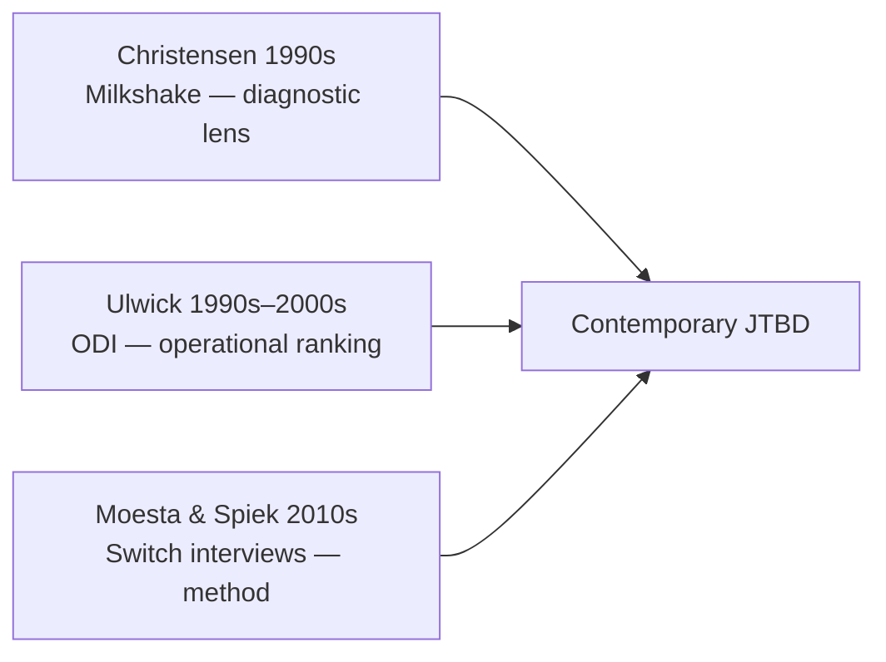
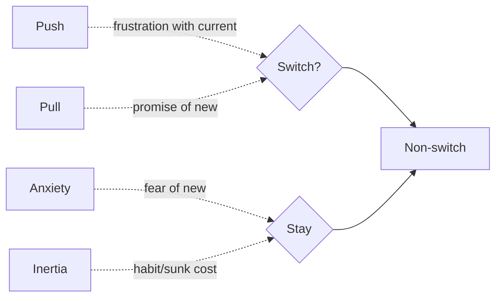
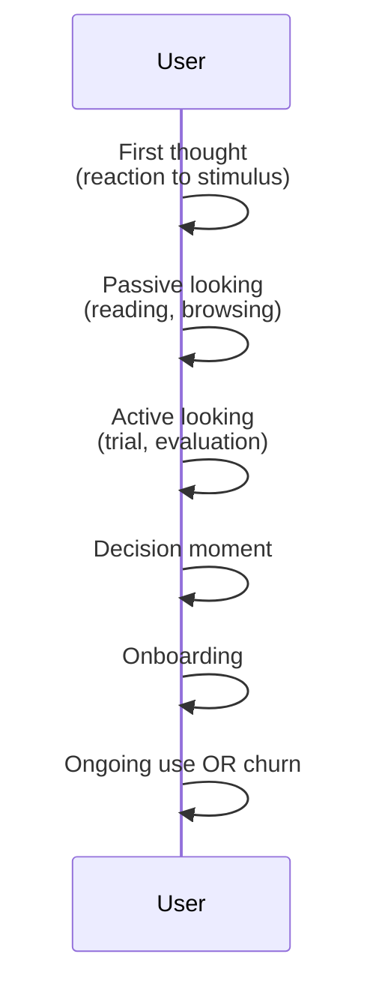

# Deep Dive Notes — Jobs-to-Be-Done (JTBD)

> `/teach-me "JTBD" --scope=deep-dive --style=intermediate` — Deep-Dive scope (~3,500 words), generated 2026-07-31 as smoke-test evidence for Plan 02c §7 criterion C3 (Deep Dive persists to `artifacts/output/teaching/notes/`). Per `teach-me/SKILL.md` Deep Dive contract.

## Table of Contents

1. [Executive Overview & First Principles](#1-executive-overview--first-principles)
2. [Historical & Theoretical Context](#2-historical--theoretical-context)
3. [Core Architecture — Jobs, Outcomes, Forces](#3-core-architecture)
4. [Operational Architecture — The Discovery Pipeline](#4-operational-architecture)
5. [Integration Architecture — From Jobs to Roadmap](#5-integration-architecture)
6. [Edge Cases, Trade-offs & Pitfalls](#6-edge-cases-trade-offs--pitfalls)
7. [Active Recall Scenarios & Self-Assessment](#7-active-recall-scenarios--self-assessment)
8. [Footnote References](#footnote-references)

---

## 1. Executive Overview & First Principles

**Jobs-to-Be-Done (JTBD)** is a product-development theory of demand that explains why people switch from one solution to another by reframing the unit of analysis from *who the user is* to *what progress the user is trying to make in a particular circumstance*. The core proposition is simple but operationally consequential:

> People don't buy products. They **hire** them to make progress. The product is the means; the progress is the end.

Four first principles follow from this:

1. **Progress is circumstance-bound.** The same person needs different progress in different circumstances; the same circumstance can require different progress from different people. Demand is conditioned by circumstance, not by identity.

2. **Switching is a four-force equilibrium.** A switch occurs only when Push + Pull outrank Anxiety + Inertia. Most non-switchers are held in place by the right-side forces; most messaging investment ignores them.

3. **Causation lives in the timeline.** The actionable cause of a switch is the **first thought** — the upstream moment the user registers that "something needs to change". Improving the Switch event itself (the conversion page) is downstream of the causal root.

4. **Opportunity lives in the gap.** Where Importance is high and Satisfaction is low, there is disproportionate opportunity to capture demand. Where Satisfaction is already high, investment yields no marginal switch.

The remainder of this note expands each principle into operational detail.

---

## 2. Historical & Theoretical Context

JTBD has two intellectual origin lines that converged in the 2010s:

**Origin Line A — Clayton Christensen's "Jobs" lens.** Christensen observed, beginning with the milkshake study in the late 1990s, that customer segmentation failed to predict demand once you allowed that the same customer hired the same product for unrelated jobs in different circumstances [1]. Christensen's contribution was primarily **diagnostic and explanatory** — a method for *seeing* demand that persona segmentation concealed.

**Origin Line B — Tony Ulwick's Outcome-Driven Innovation (ODI).** Working in parallel through the 1990s at Strategyn, Ulwick developed an **operational** method: enumerate the outcomes by which a customer measures success on a job, survey those outcomes on Importance and Satisfaction, and prioritize where the gap is widest [2]. Ulwick's contribution was primarily **procedural** — a method for *measuring* and *ranking* demand.

The synthesis was catalyzed by Bob Moesta and Chris Spiek in the early 2010s **switch-interview** practice that operationalized the four forces as a temporal, behavioral interview protocol rather than an attitudinal survey [3]. The contemporary working consensus accepts all three contributions: Christensen's diagnostic lens, Ulwick's ODI ranking procedure, Moesta's switch-interview method.

The diagram below organizes the lineage:

---

## 3. Core Architecture

### 3.1 The Job Object — A Three-Dimensional Construct

A Job in JTBD is the progress a person is trying to make in a particular circumstance. It is *not* a task, a feature request, or a need statement. Every Job carries three dimensions that must be specified to be actionable:

- **Functional** — the observable thing accomplished (e.g., *"reconcile supplier invoices at month-end within 2 hours"*).
- **Emotional** — how the user wants to feel during and after (e.g., *"feel confident the books will close without rework"*).
- **Social** — how the user expects to be perceived by relevant others (e.g., *"appear prepared to the CFO"*).

A roadmap item that specifies functional outcomes while ignoring emotional and social dimensions will move functional KPIs but fail to shift retention — emotional and social forces carry most of the Anxiety/Inertia load, and most switches are blocked at those layers.

### 3.2 Job Statement as a Grammatical Object

The Job must be expressed as a **grammatical object** with three required components, or it degenerates into an aspiration:

| Component | Role | Test |
|---|---|---|
| Verb | Actionable, third-person ("reconcile", "schedule", "verify") | Reject "be", "have", "use" |
| Object | Concrete artifact or domain acted upon | Reject category nouns ("data", "stuff") |
| Context clarifier | Circumstantial narrowing | Reject generic qualifiers |

Two canonical phrasings are accepted:

- **Ulwick form** [2]: `When I [situation], I want to [motivation], so I can [expected outcome].`
- **Bedford form**: `Help me [verb] [object] [context].`

A Job that fails any of the three tests is not a Job; it is a wish or a *solution-shaped job* and should be remediated before discovery proceeds.

### 3.3 Main Jobs and Related Jobs

A user typically has one **main job** for the product and 3–8 **related jobs** that share the circumstance. Discipline requires cataloging the whole system before ranking. Prioritizing only the main job systematically misses adjacent demand — frequently demand that turns out to dominate switching once measured.

### 3.4 The Four Forces of Progress

Switching is governed by four competing forces [3]:

Critically, **Anxiety + Inertia generally outweigh Push + Pull** in non-switching populations. Most roadmap investment and most marketing spend concentrates on Push and Pull — which explains the chronic underperformance of feature-led roadmaps against incumbents with strong habit lock-in.

### 3.5 The JTBD Timeline

A switch is an **extended causal chain**:

The **first thought** is the upstream cause. Most teams optimize events near the decision moment; the JTBD lens argues the highest-leverage work is identifying the first thought trigger and instrumenting its detection. Products that win switches detect first thoughts across channels (integration discovery, content marketing, partner channels) before competitors see them at active-looking stage.

---

## 4. Operational Architecture — The Discovery Pipeline

JTBD is operationalized through a repeatable pipeline that converts raw user behavior into ranked roadmap commits.

### 4.1 Switch Interview Protocol

The **switch interview** is the canonical JTBD discovery method [3]. It differs from a usability test by being **temporal, backward-walking, and behavioral**:

1. **Anchor** the participant in the precise moment of switching (date, location, surrounding event).
2. **Walk backward** from switch to **first thought**, reconstructing the timeline of triggers, evaluations, and hesitations.
3. **Code forces event-by-event** — for each event, identify whether Push, Pull, Anxiety, or Inertia was active and what triggered it.
4. **Suppress speculation** — when the participant offers "I would have…", redirect to concrete past behavior.

Forward recall reconstructs a plausible-sounding *rationalization*; backward recall reconstructs *causation*.

### 4.2 The Forces Worksheet

Per interview transcript, produce a forces worksheet:

| Event (date) | Force | Trigger | Quote |
|---|---|---|---|
| 2026-04-12 | Push | Manual export 4 hours | "I missed standup" |
| 2026-04-25 | Pull | Saw competitor demo | "Their live query looked instant" |
| 2026-05-02 | Anxiety | Dashboards migration fear | "What if I lose the audit trail?" |
| 2026-05-10 | Inertia | Excel formula investment | "Two years in those sheets" |
| 2026-05-15 | Switch event | Budget approval | "Bit the bullet" |

Aggregating ≥5 such worksheets surfaces repeatable force patterns across individuals — patterns invisible in feature-usage analytics.

### 4.3 Outcome Statements — Ulwick ODI

For each main Job, enumerate 10–50 **outcome statements** [2] using one of three templated forms:

1. `Minimize the time it takes to <verb> <object> <context>.` (Speed outcomes)
2. `Minimize the likelihood of <negative outcome> when <verb> <object> <context>.` (Risk outcomes)
3. `Maximize the extent to which <verb> <object> <context>.` (Quality outcomes)

Outcome statements are the *measurable* success criteria by which the user evaluates any product hired for the job.

### 4.4 The Opportunity Score

Survey a target sample (n ≥ 100, demographically aligned to the job's circumstance) on two 1–10 scales per outcome:

- **Importance** I
- **Satisfaction** S (with current solutions)

Then compute:

$$\text{Opportunity}(I, S) = I + \max(I - S, 0)$$

**Decision rule:** rank opportunities descending; commit a release to the top 3–5 outcomes per quarter. The formula intentionally rewards *unmet important outcomes* over *already-satisfied important outcomes* — investing where Satisfaction is already high yields no marginal switchers [2]. This is the foundation of ODI's roadmap prioritization discipline.

### 4.5 Cluster Discipline — n ≥ 5

A core operational guardrail: **do not pivot the roadmap on fewer than five switch interviews per cluster.** A compelling narrative at n=1 is statistically indistinguishable from noise; the cognitive ease of vivid anecdotes produces chronic over-generalization in product teams. Five worksheets surface repeating patterns that single interviews cannot.

---

## 5. Integration Architecture — From Jobs to Roadmap

### 5.1 From Opportunity-Ranked Outcomes to Release Commits

Translate the ranked Opportunity Scores into commits:

1. Plot all candidate outcomes with their Opportunity Score.
2. Cap each release to **3–5 top-scoring outcomes** for the quarter.
3. Defer features tied to low-Opportunity jobs even when they have vocal internal advocates.
4. Document the deferrals in `lessons-learned.md` so the next quarter's review can confirm or refute the Opportunity calculation.

Opportunity does not replace engineering sequencing. It replaces gut prioritization.

### 5.2 The Design Brief — Job-to-Feature Translation

Each top job is rendered into a design brief with five mandatory rows:

| Brief row | Content |
|---|---|
| Job statement | Validated job |
| Target circumstance | Segment + scenario |
| Current force balance | Push/Pull/Anxiety/Inertia summary |
| Proposed force shift | Which forces to address via which UX lever |
| Success metric | Job-completion proxy |

A brief that omits the **force shift row** is a feature request in disguise; reject it back to discovery. The force shift row is what makes the brief different from "we should add a feature for X".

### 5.3 Messaging vs. Onboarding: Different Force Targets

Two separate channels address different force pairs:

- **External marketing** targets the **Pull** force — promise the future state, demonstrate it in customer language, and reinforce it with social proof and testimonials.
- **Onboarding UX** targets the **Anxiety** and **Inertia** forces — reduce fear of migration, lower the perceived switching cost, surface quick wins, and contain anxiety events like rapid back-button presses, abandoned first-session flows, integration-discovery confusion.

Conflating the two — running Pull messaging in onboarding — increases anxiety without moving pull. Most "we onboarded with a tour but retention dropped" failures are conflations of these responsibilities.

### 5.4 North-Star Metrics — Leading vs. Lagging

Choose a **North-Star metric** that reflects hired-for progress, not engagement with surfaces [1][2]:

- ❌ *Lagging* examples: daily active users, session length, screen views. These metrics correlate with retention in incumbents and fail to predict switches to or from a new product.
- ✅ *Leading* examples: percentage of subscribed users who end the budgeting month within budget (job-completion); percentage of new analysts who completed their first reconciliation in <24h of activation (job-completion within habit-formation window).

The discipline is: a North-Star metric must correspond to a job completion event the user would identify as *success on their own terms*, not as *usage of your product*.

### 5.5 Job-Surface Collisions — Resolve Explicitly

When two top jobs crowd the same product surface (same button, same dashboard), the conflict must be resolved explicitly:

- **Separable audience** — serve job A on surface variant 1, job B on surface variant 2.
- **Separable circumstance** — serve job A in weekday mode, job B in weekend mode (when circumstances differ predictably).
- **Explicit deprioritization** — name which job is on the bench, record the trade-off in `artifacts/memory/active-decisions.md`. Never silently compromise.

Silent compromises accumulate. Recorded ones become input to next-quarter retroactive Opportunity re-ranking.

---

## 6. Edge Cases, Trade-offs & Pitfalls

### 6.1 Aspirational Jobs

- **Symptom:** verb is "be" or "have", object is abstract, context clarifier absent ("be more productive").
- **Diagnosis:** discovery team reproduced a desired identity rather than observed progress.
- **Fix:** drill to a concrete circumstance ("reconcile supplier invoices at month-end in <2 hours"). Push for a verb producing an observable artifact.

### 6.2 Solution-Shaped Jobs

- **Symptom:** verb or object names a product category ("use a mobile app", "have a dashboard").
- **Diagnosis:** solution-spotting rather than job-framing.
- **Fix:** replace with the underlying functional progress beneath the named solution ("catch up on industry news while waiting in line").

### 6.3 Persona-Driven Jobs

- **Symptom:** jobs vary by persona label ("Enterprise Erin's job" vs "Startup Sam's job") but are semantically identical in circumstance.
- **Diagnosis:** discovery reproduced legacy persona segmentation rather than allowing circumstance to drive the cluster.
- **Fix:** re-cluster by circumstance. Retire redundant persona bins. Keep persona metadata *where messaging tone depends on it*; otherwise drop.

### 6.4 Single-Interview Generalization

- **Symptom:** roadmap pivots on a single switch story.
- **Diagnosis:** cognitive ease of a vivid narrative overwhelmed the n=1 statistics.
- **Fix:** require **minimum n=5 switch interviews per cluster.** Document the threshold in the team's research operating procedure and enforce it via PR review of roadmap artifacts.

### 6.5 Anxiety/Inertia Invisibility

- **Symptom:** brilliant new feature launches; conversion is sluggish; churn spikes in the first two weeks.
- **Diagnosis:** team invested in Pull (messaging) and Push (feature parity); forgot Anxiety (onboarding disorientation) and Inertia (no clear migration path from incumbent).
- **Fix:** ticket ~25% of onboarding work per major release explicitly to reduce Anxiety/Inertia. Instrument anxiety events — back-button spikes inside first-session funnels, time-on-task in first session, first-week uninstall rate — and surface them weekly.

### 6.6 Opportunity-Score Manipulation

The Opportunity formula is robust to noise in the inputs but is vulnerable to **three manipulation patterns**:

- **Survey-design framing effects:** leading questions can inflate Importance. Use neutral prompt language and anchor on a five-point ladder rather than YES/NO.
- **Sample-frame bias:** if the n≥100 sample is drawn from current users only, Satisfaction scores for already-satisfied outcomes will dominate. Include lapsed and competitor users in the sample.
- **Outcome inflation:** long outcome lists (50+) reduce respondents' attention; cap at 25 outcomes per instrument or split into two instruments.

### 6.7 Trade-off: Discovery Investment vs. Speed to Ship

JTBD rigor costs time. For a small team under deadline pressure, these trade-offs are defensible:

- Accept n=3 instead of n=5 (statistically weak — record the limitation).
- Survey n=30 instead of n=100 (directional only — record the limitation).
- Skip the Opportunity survey and rank by qualitative cluster strength only.

Each shortcut adds roadmap risk. Record every shortcut; revisit at the next retro with launch data to calibrate.

---

## 7. Active Recall Scenarios & Self-Assessment

### Scenario 1 — Diagnose a malformed job statement

> "Make me more productive at work."

**Diagnosis:** aspirational job — verb "make" is not actionable, object "more productive" is abstract (not a concrete artifact), context clarifier absent (no circumstance specified).

**Remediated Ulwick form:** "When I [start a month-end close], I want to [reconcile all supplier invoices within 4 hours], so I can [approve the books before the 5th]."

**Remediated Bedford form:** "Help me reconcile all supplier invoices within 4 hours at month-end close."

### Scenario 2 — Forces coding exercise

You interview an FP&A analyst who recently switched spreadsheet tools. Selected timeline events:

- Jan 15: "Manual formulas took 8 hours to update."
- Feb 8: "Saw a competitor ad while researching budget templates."
- Feb 22: "Worried my entire 5-year history of sheets wouldn't import."
- Mar 1: "Filed annual review emphasizing the migration cost."
- Mar 10: **Switch event** — budget approved.

**Code each event:**

| Event | Force | Trigger |
|---|---|---|
| Jan 15 | **Push** | 8-hour manual update pain |
| Feb 8 | **Pull** | Competitor demo promise |
| Feb 22 | **Anxiety** | Migration cost fear |
| Mar 1 | **Inertia** | 5-year sunk cost surfaced explicitly |
| Mar 10 | Switch event | Budget approval resolves anxiety+inertia threshold |

**Insight:** Anxiety + Inertia dominated for 6 weeks before Push + Pull could overcome them. If the team had invested only in feature parity (Pull) the analyst would still be held by inertia.

### Scenario 3 — Opportunity computation

You survey 100 budgeting-app users on five outcome statements. Compute Opportunity and rank:

| Outcome | I (mean) | S (mean) | Opportunity |
|---|---|---|---|
| A | 9 | 7 | **11** |
| B | 8 | 4 | **12** |
| C | 9 | 9 | **9** |
| D | 7 | 3 | **11** |
| E | 10 | 8 | **12** |

**Rank order:** B (12) = E (12) > A (11) = D (11) > C (9).
**Commit:** B and E are top-tier opportunities; A and D are tied; defer C (high Satisfaction — already met).

### Scenario 4 — North-Star selection

For a meal-delivery product hired on the job "eat a stress-free weeknight dinner after a long workday", compare candidate North-Star metrics:

- *DAU/week*: lagging; correlates with incumbent habit, doesn't predict retention.
- *Average session length*: lagging; rewards slow app use, not job completion.
- *% of subscribed users who report "skipped cooking" at least 3 nights per week*: **leading** — matches the hired-for progress directly.
- *First-week retention*: leading for habit formation but doesn't measure job success per se.

**Selected North-Star:** percent of users who report skipped-cooking ≥3 nights/week.

### Scenario 5 — Pitfall mapping

A roadmap board contains: "build dark mode", "improve NPS by 5 points", "add onboarding checklist". For each:

| Item | Pitfall | Diagnosis |
|---|---|---|
| Build dark mode | Solution-shaped job — no validated job cited. | Requires JTBD discovery before commitment. |
| Improve NPS by 5 points | Engagement-as-North-Star; doesn't reflect job completion. | Replace with job-completion metric. |
| Add onboarding checklist | Conflates Anxiety reduction (good) with feature add (no job cited). | Tie directly to an Anxiety-coded event from switch interviews. |

---

## Footnote References

- [1] Christensen, C. M., Hall, T., Dillon, K., & Duncan, D. S. (2016). "Know Your Customers' 'Jobs to Be Done'." *Harvard Business Review*. https://hbr.org/2016/09/know-your-customers-jobs-to-be-done
- [2] Ulwick, A. W. (2016). *Jobs To Be Done: From Theory to Practice*. Idea Press.
- [3] Spiekermann, C. (2018). "Jobs to be Done: A Framework for Customer Needs." https://jobs-to-be-done.com
- [4] Moesta, B. & Spiek, C. (2017). *Demand-Side Sales 101*. Mainland Press.

---

## Inline Summary

This Deep Dive note covers the **first principles** (progress is circumstance-bound, switching is a four-force equilibrium, causation lives in the first thought, opportunity lives in the Importance-Satisfaction gap), the **operational pipeline** (switch interview → forces worksheet → outcome statements → Opportunity score → release commit), and **common pitfalls** with their prescribed fixes. For structured, multi-format teaching materials (syllabus, handbook, cheatsheet, presentation, class modules, video script), escalate to `/craft-lesson` and reference `artifact/output/teaching/knowledge-map.md` for the current topic.

*Active recall: try the five scenarios above before re-reading the answers. Verify each remediation against the principles; if you catch a principle that's been violated in your current roadmap, write it to `lessons-learned.md` before the next retro.*